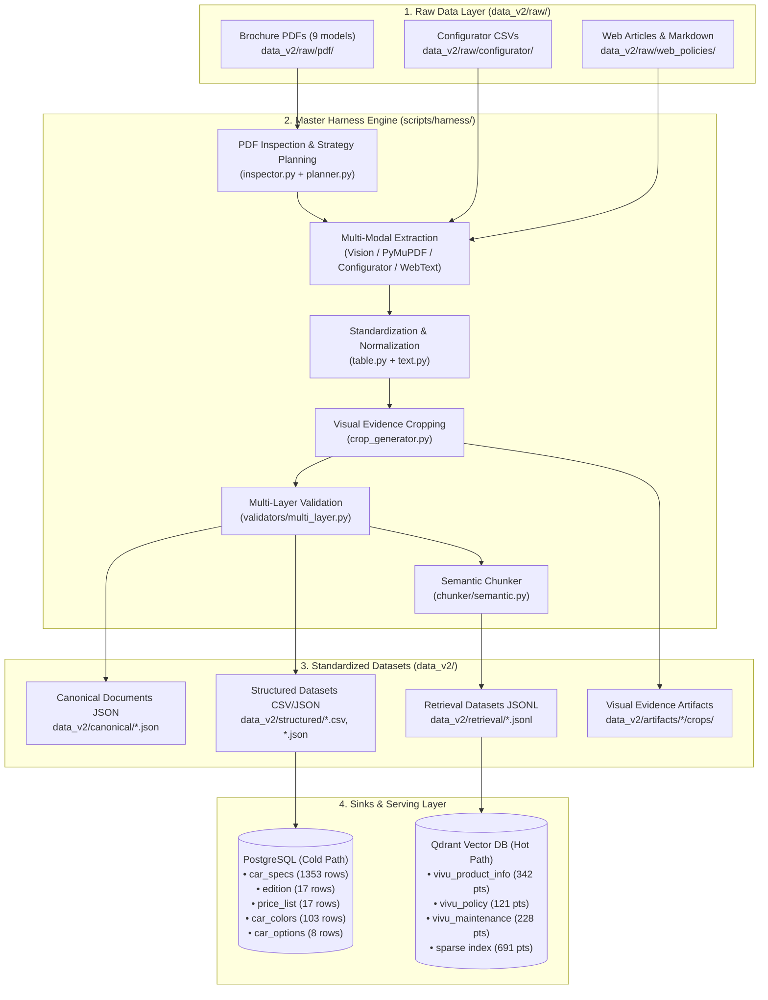

# Unified Agentic Document & Data Ingestion Harness

Tài liệu thiết kế kiến trúc, cấu trúc dữ liệu và hướng dẫn vận hành cho hệ sinh thái dữ liệu VinFast (**Unified Ingestion Harness**).

Hệ thống hợp nhất toàn bộ luồng thu thập, bóc tách tài liệu phức tạp (Brochure PDF đa cột, Bảng thông số kỹ thuật, Cấu hình xe, Chính sách bán hàng & bảo dưỡng) thành **1 Engine duy nhất** ([`scripts/harness/`](file:///D:/FULearning/vin/vivu/scripts/harness/)) và **1 Thư mục dữ liệu chuẩn duy nhất** ([`data_v2/`](file:///D:/FULearning/vin/vivu/data_v2/)).

---

## 1. Kiến trúc Tổng thể & Nguyên lý Thiết kế



### Nguyên lý thiết kế then chốt:
1. **Single Source of Truth**: Loại bỏ phân mảnh file dữ liệu. Toàn bộ input thô, file trung gian và file xuất chuẩn đều nằm tại `data_v2/`.
2. **Deterministic Category Slugs**: Khớp 100% với Agent SQL Tools (`app/agent/tools.py`), chuyển đổi toàn bộ danh mục thông số sang tiếng Anh chuẩn (`dimension`, `powertrain`, `battery`, `chassis`, `exterior`, `interior`, `infotainment`, `convenience`, `safety`, `security`, `adas`, `connected`).
3. **Visual Traceability & Provenance**: Mỗi thông số kỹ thuật trích xuất đều lưu giữ tọa độ bounding box (`BBox`), số trang và đường dẫn ảnh crop bằng chứng trực tiếp từ tài liệu gốc.
4. **Isolated Versioning (Safe Test Mode)**: Mọi thao tác nạp version mới (`v3`) đều ở trạng thái `is_current = false` và collection vật lý riêng biệt (`*__v3`). Production (`v2`) không bị ảnh hưởng cho đến khi thực hiện `promote`.

---

## 2. Cấu trúc Thư mục Dữ liệu ([`data_v2/`](file:///D:/FULearning/vin/vivu/data_v2/))

```
data_v2/
├── raw/                                # DỮ LIỆU ĐẦU VÀO THÔ
│   ├── pdf/                            # 9 brochure PDF gốc chất lượng cao
│   │   ├── vf2_brochure.pdf
│   │   ├── vf3_brochure.pdf
│   │   └── ... (đến vf_mpv7_brochure.pdf)
│   ├── configurator/                   # CSV bóc tách từ window.carDeposit
│   │   ├── edition.csv
│   │   ├── price_list.csv
│   │   ├── colors.csv
│   │   └── options.csv
│   ├── web_policies/                   # Bài viết chính sách, bảo hành, pin, bảo dưỡng
│   └── web_deposit/                    # Dump text mô tả từ trang đặt cọc
├── canonical/                          # CANONICAL DOCUMENT JSON (9 xe)
│   ├── vf2_brochure.json
│   └── ...
├── structured/                         # DỮ LIỆU ĐÃ CHUẨN HÓA (CHO POSTGRESQL)
│   ├── all_models_specs.json           # 1,353 thông số kỹ thuật toàn bộ dải xe
│   ├── all_models_specs.csv            # Bản CSV phân tách bằng dấu '|'
│   ├── edition.csv                     # Danh sách 17 phiên bản xe
│   ├── price_list.csv                  # Giá bán niêm yết, VAT, Pin
│   ├── car_colors.csv                  # 103 mã màu ngoại/nội thất
│   └── car_options.csv                 # 8 tùy chọn nâng cấp
├── retrieval/                          # DỮ LIỆU CHUNKS VECTOR (CHO QDRANT)
│   ├── all_models_chunks.jsonl         # 691 chunks tổng hợp toàn hệ thống
│   ├── policies/
│   │   ├── vivu_product_info.jsonl     # Chunks brochure thông số & sản phẩm
│   │   ├── vivu_policy.jsonl           # Chunks chính sách bảo hành, pin
│   │   └── vivu_maintenance.jsonl      # Chunks quy trình bảo dưỡng
│   └── sparse_index.json               # Từ điển vocab + IDF cho BM25 search
└── artifacts/                          # HÌNH ẢNH TRANG VÀ BẰNG CHỨNG CROP
    ├── vf3_brochure/
    │   ├── pages/                      # Ảnh render từng trang PDF
    │   └── crops/                      # Ảnh cắt từng khối bảng/thông số
    └── ...
```

---

## 3. Cấu trúc Source Code ([`scripts/harness/`](file:///D:/FULearning/vin/vivu/scripts/harness/))

| Module | Chức năng chính |
| :--- | :--- |
| [`pipeline.py`](file:///D:/FULearning/vin/vivu/scripts/harness/pipeline.py) | **Master CLI Entrypoint**. Điều phối toàn bộ 5 Phase: Configurator -> Brochures -> Web Articles -> Consolidation -> Database Ingestion. |
| [`batch_runner.py`](file:///D:/FULearning/vin/vivu/scripts/harness/batch_runner.py) | Điều phối chạy trích xuất đồng loạt 9 xe, tự động tải PDF nếu thiếu, hỗ trợ filter và resume. |
| [`orchestrator.py`](file:///D:/FULearning/vin/vivu/scripts/harness/orchestrator.py) | Điều phối pipeline 6 bước trên từng brochure: Inspect -> Plan -> Extract -> Normalize -> Crop Evidence -> Validate -> Assemble. |
| [`config.py`](file:///D:/FULearning/vin/vivu/scripts/harness/config.py) | Tập trung cấu hình đường dẫn `data_v2/`, danh mục 9 dòng xe, DSN PostgreSQL, Qdrant URL và OpenAI Embedding. |
| [`schemas.py`](file:///D:/FULearning/vin/vivu/scripts/harness/schemas.py) | Định nghĩa Pydantic models: `CanonicalDocument`, `CanonicalBlock`, `SpecItem`, `BBox`, `Evidence`, `RetrievalChunk`. |
| [`extractors/`](file:///D:/FULearning/vin/vivu/scripts/harness/extractors/) | Các bộ trích xuất chuyên dụng: <br/>• `pymupdf.py`: Text native từ PDF vector.<br/>• `vision.py`: Gemini Vision trích xuất bảng & bố cục phức tạp.<br/>• `configurator.py`: Bóc tách giá, phiên bản, màu sắc từ configurator.<br/>• `web_text.py`: Bóc tách bài viết chính sách, bảo dưỡng, cứu hộ. |
| [`normalizers/`](file:///D:/FULearning/vin/vivu/scripts/harness/normalizers/) | Bộ chuẩn hóa: <br/>• `table.py`: Ánh xạ 100+ thuộc tính sang slug tiếng Anh chuẩn và đơn vị chuẩn (`mm`, `kW`, `kWh`, `km`, `triệu`).<br/>• `text.py`: Dọn dẹp noise, làm sạch giá tiền trong vector để tránh ảo giác khi embed. |
| [`chunker/semantic.py`](file:///D:/FULearning/vin/vivu/scripts/harness/chunker/semantic.py) | Phân đoạn ngữ nghĩa: Tự động tổng hợp bảng thông số kỹ thuật thành câu văn tự nhiên phục vụ truy xuất RAG. |
| [`sinks/postgres.py`](file:///D:/FULearning/vin/vivu/scripts/harness/sinks/postgres.py) | Xuất file structured và nạp PostgreSQL versioned theo thứ tự bảo toàn khóa ngoại (Child-first delete, Parent-first insert). |
| [`sinks/qdrant.py`](file:///D:/FULearning/vin/vivu/scripts/harness/sinks/qdrant.py) | Nạp Qdrant: Tạo dense collection (`size=1536, Cosine`), embed bằng `text-embedding-3-small` và lập chỉ mục BM25 Sparse Vector. |

---

## 4. Đặc tả Dữ liệu Lưu trữ (Database Schemas)

### 4.1. PostgreSQL Schema Contract
- **`car_specs`**:
  - `ingest_version` (VARCHAR): Ví dụ `'v3'`.
  - `model_code` (VARCHAR): `'VF 2'`, `'VF 3'`, ..., `'VF 9'`, `'VF MPV 7'`.
  - `version_name` (VARCHAR): `'Eco'`, `'Plus'`, `'TieuChuan'`, `NULL`.
  - `spec_category` (VARCHAR): `dimension`, `powertrain`, `battery`, `chassis`, `exterior`, `interior`, `infotainment`, `convenience`, `safety`, `security`, `adas`, `connected`.
  - `spec_category_vn` (VARCHAR): Nhãn tiếng Việt tương ứng.
  - `spec_key` (VARCHAR): `length_mm`, `power_kw`, `battery_kwh`, `ground_clearance_mm`,...
  - `spec_key_vn` (VARCHAR): Tên tiếng Việt của thuộc tính.
  - `spec_value` (TEXT): Giá trị chuẩn hóa.
  - `spec_unit` (VARCHAR): Đơn vị chuẩn (`mm`, `kW`, `kWh`, `km`, `triệu`,...).
- **`edition`**: `version`, `model_id`, `edition_id`, `model_label`, `edition_label`, `year_range`, `is_active`.
- **`price_list`**: `version`, `model_id`, `edition_id`, `price_list_vnd`, `price_promo_vnd`, `vat_included`, `battery_included`, `valid_from`, `valid_to`.
- **`car_colors`**: `ingest_version`, `model_id`, `version_code`, `version_name`, `color_code`, `color_name`, `color_type`, `color_fee_vnd`.
- **`car_options`**: `ingest_version`, `model_id`, `version_code`, `version_name`, `option_group`, `option_name`, `value_name`, `price_extra_vnd`.
- **`ingest_version`**: Bảng kiểm toán phiên bản (`version`, `created_at`, `is_current`, `pg_rows_upserted`, `notes`).

### 4.2. Qdrant Collections Contract
Mỗi phiên bản `<v>` quản lý 4 collections độc lập:
1. `vivu_product_info__<v>`: Thông số xe và tính năng sản phẩm từ brochure & web.
2. `vivu_policy__<v>`: Chính sách bảo hành xe & pin, cứu hộ 24/7, ưu đãi.
3. `vivu_maintenance__<v>`: Quy trình đặt lịch và hạng mục bảo dưỡng định kỳ.
4. `sparse__<v>`: Chỉ mục BM25 Sparse Vector cho Hybrid Search (RRF).

---

## 5. Hướng dẫn Dành cho Thành viên mới (Quick Onboarding Guide)

### 5.1. Khi clone / pull code từ Git về máy mới:
Bạn **KHÔNG CẦN** chạy lại Vision LLM hay tốn tiền gọi OpenAI API:
- Toàn bộ dữ liệu sạch đã được chuẩn hóa và lưu sẵn trong Git tại:
  - `data_v2/structured/` (Thông số xe, bảng giá, màu sắc, tùy chọn nâng cấp).
  - `data_v2/retrieval/` (Dữ liệu chunks và chỉ mục sparse BM25).
- Bạn chỉ cần chạy **1 lệnh duy nhất** (mất ~2 giây) để nạp toàn bộ vào PostgreSQL và Qdrant cục bộ:

```powershell
.\.venv\Scripts\python.exe scripts/version_manager.py promote --version v3
```
*(Hoặc chạy: `.\.venv\Scripts\python.exe scripts/run_pipeline.py --skip-extract --skip-embed --version v3`)*

---

### 5.2. Quy tắc Quản lý Git & Thư mục (`data_v2/`):

| Thư mục | Trạng thái Git | Dung lượng | Mục đích |
| :--- | :---: | :---: | :--- |
| **`data_v2/artifacts/`** | 🚫 **`.gitignore`** | ~250 MB | Chứa ảnh render từng trang và bounding box crops (nặng, chỉ dùng cho audit). |
| **`data_v2/canonical/`** | 🚫 **`.gitignore`** | ~3 MB | File JSON trung gian trong quá trình pipeline bóc tách. |
| **`data_v2/raw/`** | ✅ **Track trên Git** | ~110 MB | Lưu file PDF brochure và nội dung chính sách web gốc. |
| **`data_v2/structured/`** | ✅ **Track trên Git** | ~2.5 MB | **Dữ liệu vàng đã chuẩn hóa** (`all_models_specs.json`, `edition.csv`, `price_list.csv`, `car_colors.csv`). |
| **`data_v2/retrieval/`** | ✅ **Track trên Git** | ~1.7 MB | **Dữ liệu chunks & Sparse index BM25** (`sparse_index.json`, `*.jsonl`). |

---

## 6. Cơ chế Đánh số trang (1-indexed) & Deep Link PDF

### 6.1. Nguyên lý 1-Indexed:
- Số trang trong hệ thống được tính từ **1** (1-indexed), khớp chính xác với số trang hiển thị trên thanh công cụ xem PDF của trình duyệt web hoặc phần mềm đọc PDF (Adobe Acrobat).

### 6.2. Cấu trúc Deep Link & Trích dẫn tự động:
- Khi bóc tách, hệ thống lưu `source_page` và tự động gắn `#page=X` vào đường dẫn URL (Ví dụ: `https://storage.googleapis.com/.../VF%203_Brochure.pdf#page=9`).
- Khi người dùng hỏi thông số hoặc bảng màu, Backend Agent tự động trích xuất đúng số trang và render định dạng Markdown:
  ```markdown
  Nguồn: [VF 3 Brochure (Trang 9)](https://storage.googleapis.com/.../VF%203_Brochure%20280126.pdf#page=9)
  ```
- Nhấp vào liên kết sẽ **mở trực tiếp đến đúng số trang trong file PDF**.

---

## 7. Hướng dẫn Vận hành & Lệnh CLI (CLI Reference)

### 7.1. Khi có 1 xe mới (ví dụ VF 10):
Chỉ cần chạy 1 lệnh bóc tách và tự động nạp:
```powershell
.\.venv\Scripts\python.exe -m scripts.harness.orchestrator --pdf data_v2/raw/pdf/vf10_brochure.pdf --model "VF 10"
```

### 7.2. Chạy lại toàn bộ Pipeline từ đầu:
```powershell
.\.venv\Scripts\python.exe scripts/run_pipeline.py --version v3 --recreate
```

### 7.3. Kiểm thử tự động Backend:
Chạy bộ test kiểm tra toàn diện câu trả lời, quyết định agent và link dẫn chứng:
```powershell
.\.venv\Scripts\python.exe scripts/eval/test_backend_answers.py
```

### 7.4. Quản lý Phiên bản & Kích hoạt (Blue-Green Deployment)
```powershell
# 1. Kiểm tra trạng thái các phiên bản hiện tại
.\.venv\Scripts\python.exe scripts/version_manager.py status

# 2. Chuyển phiên bản v3 thành chính thức (cập nhật active view DB và tráo Qdrant alias)
.\.venv\Scripts\python.exe scripts/version_manager.py promote --version v3

# 3. Quay lại phiên bản trước đó ngay lập tức (Zero-downtime Rollback)
.\.venv\Scripts\python.exe scripts/version_manager.py rollback
```
