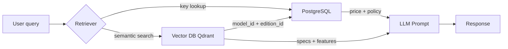

# UC-01 — Product Information

> Priority: [MUST]
> User Story: Là người đang tìm hiểu mua xe, tôi muốn tra cứu thông số, tính năng, giá và chính sách để hiểu rõ một mẫu xe hoặc phiên bản.

---

## 1. Mục tiêu use case

Cung cấp cho người dùng thông tin chính xác, kịp thời về:

- **Thông số kỹ thuật** của từng mẫu xe và phiên bản.
- **Mô tả sản phẩm**, tính năng nổi bật, ngoại/nội thất, công nghệ.
- **Giá xe**: niêm yết và giá ưu đãi hiện hành.
- **Chính sách**: bảo hành, thuê pin, điều khoản pháp lý, FAQ bán hàng.
- **Link tham khảo**: chi phí lăn bánh, khuyến mãi, showroom/trạm sạc (không lưu chi tiết trong DB).

---

## 2. Kiến trúc dữ liệu

Dữ liệu được tách thành **2 DB** để cân bằng giữa độ chính xác và chi phí cập nhật.



### 2.1. Vector DB (Cold — ít đổi)

| Collection | Nội dung | Cập nhật |
|---|---|---|
| `vivu_specs` | Bảng so sánh thông số, ADAS, thông số kỹ thuật | Theo tháng/quý |
| `vivu_product_info` | Mô tả sản phẩm, tính năng, màu sắc, công nghệ | Theo tháng/quý |
| `vivu_policy` | Chính sách bảo hành, dịch vụ pin/sửa chữa/cứu hộ, sổ bảo hành PDF | Theo tháng/quý |
| `vivu_maintenance` | Lịch trình & hạng mục bảo dưỡng | Theo năm |

> Không còn `vivu_faq` — nguồn raw hiện tại không có dữ liệu FAQ.

### 2.2. PostgreSQL (Hot — hay đổi)

| Bảng | Nội dung | Cập nhật |
|---|---|---|
| `edition` | Bản đồ model × edition | Theo đợt ra mắt xe/phiên bản |
| `price_list` | Giá niêm yết, giá ưu đãi, khuyến mãi | Theo ngày/tuần/chiến dịch |
| `maintenance_schedule` | Lịch bảo dưỡng chi tiết (nếu có) | Theo năm |
| `ingest_version` | Tracking version đã ingest | Mỗi lần ingest |

### 2.3. Không lưu DB — chỉ trả link

| Thông tin | Lý do không lưu |
|---|---|
| Brochure PDF (8 file) | File nặng, không embed text — chỉ giữ URL trong `_manifest.json["link_only"]` |

---

## 3. Luồng xử lý câu hỏi

### 3.1. Ví dụ: "VF 9 Plus giá bao nhiêu?"

1. **Vector search** trên `vivu_specs` + `vivu_product_info` với query embedding.
2. Từ chunk match, lấy `model_id = VF9`, `edition_id = Plus`.
3. **PostgreSQL JOIN**: `SELECT * FROM price_list WHERE model_id='VF9' AND edition_id='Plus' AND valid_to IS NULL`.
4. Ghép thông tin specs + giá vào prompt LLM.
5. LLM trả lời bằng tiếng Việt, dùng số giá từ Postgres.

### 3.2. Ví dụ: "VF 9 có những màu ngoại thất nào?"

1. Vector search trên `vivu_product_info`.
2. Trả về chunk màu sắc (không cần Postgres).

### 3.3. Ví dụ: "Tải brochure VF 8"

1. Không query DB lấy số liệu.
2. Trả link nguồn từ `_manifest.json["link_only"]["brochure_urls"]`:
   - Brochure VF 8: `https://storage.googleapis.com/vinfast-data-01/brochure/VF8_Brochure_03022026.pdf`

---

## 4. Pipeline dữ liệu

```text
scripts/clean_data/clean_to_jsonl.py --version v1
        ↓
data/clean/v1/intermediate/
        ↓
scripts/clean_data/split_cold_hot.py --version v1
        ↓
data/clean/v1/vector/*.jsonl
data/clean/v1/postgres/*.csv
data/clean/v1/_manifest.json
        ↓
scripts/ingest/vector_ingest.py --version v1  → Qdrant
scripts/ingest/postgres_ingest.py --version v1 → PostgreSQL
```

Chi tiết chạy từng bước xem:

- `data/DATA_PIPELINE_GUIDE.md`
- `scripts/ingest/README.md`

---

## 5. Schema tóm tắt

### 5.1. Vector chunk (mỗi dòng JSONL)

```json
{
  "id": "vivu_specs:vf8:all:so_sanh:1",
  "collection": "vivu_specs",
  "vector_version": "v1",
  "model_id": "VF8",
  "edition_id": null,
  "category": "thong_so_ky_thuat",
  "section_path": ["thong_so_ky_thuat", "Hiệu suất và động cơ"],
  "text": "VF8 Plus có công suất tối đa 300 kW (402 hp), mô-men xoắn cực đại 620 Nm...",
  "text_type": "prose",
  "structured": {},
  "language": "vi",
  "tags": ["thong_soky_thuat", "vf8"],
  "confidence": 0.8,
  "source_file": "data/raw/so-sanh-vf8-eco-va-vf8-plus-p56_....txt",
  "source_url": "https://www.vinfastmiennam.vn/so-sanh-vf8-eco-va-vf8-plus-p56",
  "source_type": "raw_html",
  "fetched_at": "...",
  "ingested_at": "..."
}
```

### 5.2. Postgres bảng `price_list`

| Cột | Ý nghĩa |
|---|---|
| `model_id` | Mã model chuẩn hóa, VD: `VF9` |
| `edition_id` | Mã edition chuẩn hóa, VD: `Eco`, `Plus` |
| `price_list_vnd` | Giá niêm yết gốc |
| `price_promo_vnd` | Giá ưu đãi hiện hành |
| `promo_label` | Tên chương trình khuyến mãi |
| `vat_included` | Đã bao gồm VAT |
| `battery_included` | Đã bao gồm pin |
| `valid_from` / `valid_to` | Hiệu lực giá |
| `source_url` | Link nguồn |

---

## 6. Quy tắc bắt buộc

1. **Vector text không chứa giá tiền**. Số tiền chỉ nằm trong Postgres.
2. **Giá ưu đãi lấy từ Postgres**, không từ embedding text.
3. **Giá chỉ trích từ trang chính thống** `vinfastauto.com` / `shop.vinfastauto.com` (page `dat-coc-*`).
4. **Brochure PDF chỉ trả link** từ `_manifest.json["link_only"]`, không trả số liệu từ DB.
5. **Mỗi model × edition = 1 row trong `edition.csv`**.
6. **Stable IDs**: `collection:model:edition:section:seq` trong JSONL, chuyển thành UUIDv5 khi ingest Qdrant.

---

## 7. Trạng thái hiện tại

| Thành phần | Trạng thái |
|---|---|
| Nguồn dữ liệu | ✅ `data/raw/` (49 file: official + PDF + article) |
| Clean pipeline | ✅ `scripts/clean_data/` |
| Vector output | ✅ `data/clean/v1/vector/*.jsonl` (2333 chunks, 4 collections) |
| Postgres CSV output | ✅ `data/clean/v1/postgres/*.csv` (14 edition + 14 price) |
| Embedding | ✅ OpenRouter `openai/text-embedding-3-small` (1536-dim, .env) |
| Ingest Qdrant (dense + sparse) | ✅ `scripts/ingest/vector_ingest.py` + `sparse_ingest.py` |
| Ingest Postgres local | ✅ `scripts/ingest/postgres_ingest.py` |
| Hybrid retriever (dense+sparse+RRF+rerank) | ✅ `backend/retriever/hybrid_retriever.py` |
| LLM response (`--answer`, OpenRouter chat) | ✅ `deepseek/deepseek-v4-flash-0731` |
| Docker Compose local DB | ✅ `docker-compose.yml` |
| Maintenance schedule chi tiết | ⏳ Chờ data bổ sung |

---

## 8. Tham khảo

- `data/EXAMPLE_DATA_FORMAT.md` — kiến trúc 2 DB chi tiết.
- `data/DATA_PIPELINE_GUIDE.md` — hướng dẫn chạy clean pipeline.
- `scripts/ingest/README.md` — hướng dẫn ingest local.
