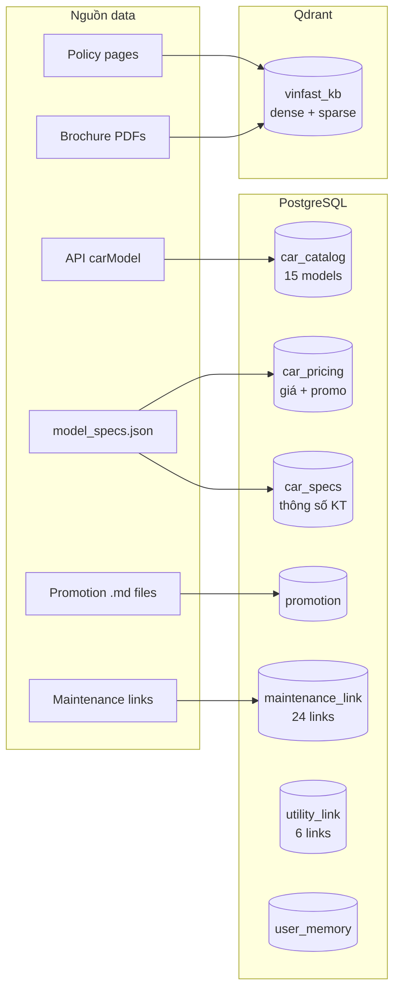
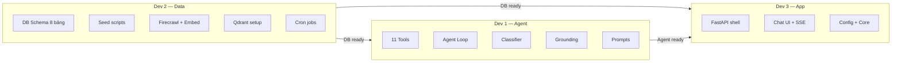
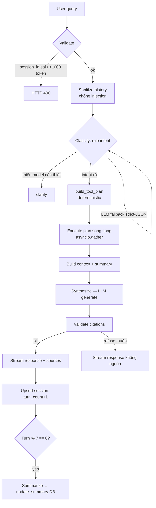
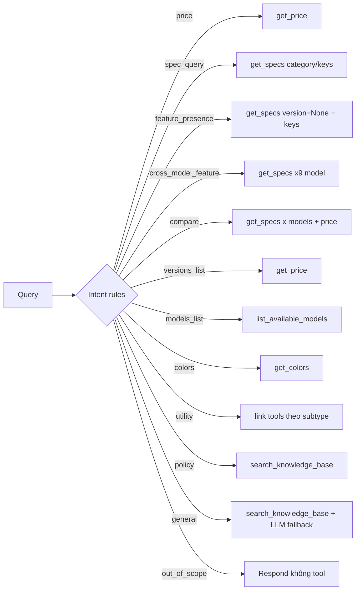

# Vivu — Agentic RAG Architecture

## Hệ thống tổng quan

```mermaid
flowchart LR
    subgraph User
        U[Khách hàng]
    end

    subgraph Agent["Agent (hybrid intent + deterministic plan)"]
        direction TB
        CLS[Classify<br/>rule intent + entity] -->|thiếu model| ASK[Hỏi lại clarify]
        CLS -->|intent rõ| PLAN[build_tool_plan<br/>deterministic]
        CLS -.LLM fallback strict-JSON.-> CLS
        PLAN --> EXEC[Execute plan song song<br/>asyncio.gather]
        EXEC --> SYN[Generate — LLM tổng hợp]
        SYN --> GND[Groundedness<br/>validate citations]
        GND -->|pass| RESP[Response]
        GND -->|refuse thuần| RESP2[Response không nguồn]
    end

    subgraph Memory["Multi-turn memory"]
        direction TB
        SESS[chat_sessions (PG)<br/>summary + turn_count]
        WIN[Window 7 turn<br/>sanitize history]
    end

    subgraph Tools["Tools"]
        direction TB
        T1[get_price]
        T2[get_specs keys/category]
        T3[search_knowledge_base]
        T4[list_available_models]
        T5[get_colors]
        T6[get_active_promotions]
        T7[link tools x5]
    end

    subgraph Data["Data Sources"]
        direction TB
        PG[(PostgreSQL<br/>car_specs, price, colors...)]
        QD[(Qdrant<br/>hybrid search 3 collection)]
    end

    subgraph Pipeline["Data Pipeline"]
        direction TB
        API[omapi.vinfastauto.com<br/>car catalog]
        JSON[model_specs.json<br/>3659 dòng specs]
        MD[data/*.md<br/>promotions, maintenance]
        EMBED[chunk → embed → Qdrant]
    end

    U -->|SSE streaming| Agent
    Agent --> Memory
    RESP --> U
    Tools --> Data
    Pipeline --> Data
```    Agent --> Tools
    Tools --> Data
    Pipeline --> Data
```

## Data Flow



## 3 Dev Split



## Module map (thêm từ 8/2026)

| Module | Vai trò | Doc chi tiết |
|---|---|---|
| `app/agent/intent.py` | Hybrid intent (12 intent) + spec_category/spec_key maps + LLM fallback strict-JSON | `docs/INTENT_PLANNING.md` |
| `app/agent/direct_plan.py` | `build_tool_plan` — intent → tool calls deterministic | `docs/INTENT_PLANNING.md` |
| `app/agent/nodes/classify.py` | Rule entity + topic + hybrid intent; clarify đúng lúc | `docs/INTENT_PLANNING.md` |
| `app/agent/history.py` | Sanitize history (chống injection, window 7 turn) | `docs/MEMORY_PLAN.md` |
| `app/core/session_store.py` | `chat_sessions` (summary, turn_count) + summarize | `docs/MEMORY_PLAN.md` |
| `app/agent/nodes/summarize.py` | Running summary mỗi 7 turn | `docs/MEMORY_PLAN.md` |
| `app/agent/llm.py` | Token limits (input 1000 reject / output 4000), `truncate_messages`, `get_llm` | `docs/MEMORY_PLAN.md` |
| `frontend/` | React+TS chat (SSE, StatusBar, markdown, localStorage session) | `docs/FRONTEND_PLAN.md` |

## Agent Loop chi tiết



## Tool Routing


