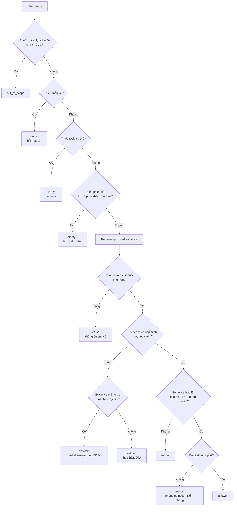

<h1 style="color: #004b93; font-size: 32px; font-weight: 800; line-height: 1.15; margin: 0 0 18px;">Behavior Decision Spec — Trust Foundation</h1>

<div style="border-top: 3px solid #004b93; margin: 0 0 28px;"></div>

<div style="background-color: #f2f6fb; border-left: 3px solid #004b93; border-radius: 0 8px 8px 0; padding: 24px 32px; margin: 0 0 32px;">

<p style="font-size: 18px; font-weight: 700; font-style: italic; line-height: 1.55; margin: 0;">Vivu quyết định khi nào trả lời, khi nào hỏi lại, khi nào từ chối và khi nào báo ngoài phạm vi trong lát cắt Trust Foundation?</p>

</div>

<h2 style="color: #004b93; border-bottom: 2px solid #dbe4ee; padding-bottom: 8px; margin: 40px 0 18px;">1. Mục Tiêu</h2>

Tài liệu này chuyển `scope-definition.md` thành luật hành vi để Product, Engineering, Data và QA cùng dùng khi build và kiểm thử lát cắt **Trust Foundation**.

Lát cắt này chỉ hỗ trợ **Product Information QA cho VF 6 và VF 8** trong phạm vi nguồn đã được phê duyệt. Vivu phải đưa ra một trong bốn quyết định cho mỗi lượt hỏi:

| Decision | Ý nghĩa |
|---|---|
| `answer` | Trả lời khi câu hỏi đủ rõ, nằm trong scope và có approved evidence chứng minh trực tiếp. |
| `clarify` | Hỏi lại khi thiếu ngữ cảnh quan trọng như mẫu xe, phiên bản hoặc chủ đề. |
| `refuse` | Từ chối/giới hạn khi câu hỏi gần scope nhưng không có đủ approved evidence hợp lệ. |
| `out_of_scope` | Báo ngoài phạm vi khi câu hỏi thuộc năng lực hoặc chủ đề chưa hỗ trợ trong slice này. |

Decision phải được log để QA có thể audit: `user_query`, detected context, retrieved sources, displayed answer, displayed citations và reason.

<h2 style="color: #004b93; border-bottom: 2px solid #dbe4ee; padding-bottom: 8px; margin: 40px 0 18px;">2. Phạm Vi Áp Dụng</h2>

Phạm vi chi tiết nằm trong `scope-definition.md` và nguồn hợp lệ nằm trong `data-source-inventory.md`. File này chỉ nhắc lại phần tối thiểu cần cho decision logic.

| Hạng mục | Giá trị trong scope |
|---|---|
| Người dùng | Khách hàng tiềm năng tại Việt Nam đang tìm hiểu mua xe VinFast |
| Kênh | Website |
| Ngôn ngữ | Tiếng Việt |
| Mẫu xe | VF 6, VF 8 |
| Phiên bản | VF 6 Eco, VF 6 Plus, VF 8 Eco, VF 8 Plus |
| Use case | Product Information QA |
| Hội thoại | Một lượt hỏi trực tiếp + một lượt hỏi lại đơn giản |

<h2 style="color: #004b93; border-bottom: 2px solid #dbe4ee; padding-bottom: 8px; margin: 40px 0 18px;">3. Decision Order</h2>

Vivu phải đánh giá decision theo thứ tự dưới đây. Thứ tự này giúp tránh việc bot trả lời khi đáng lẽ phải hỏi lại, từ chối hoặc báo ngoài phạm vi.

<div style="background-color: #f2f6fb; border-left: 4px solid #006fbf; border-radius: 0 8px 8px 0; padding: 12px 16px; margin: 12px 0 18px;">

<strong>Source-of-truth note:</strong> <code>Decision Order</code> và <code>Decision Table</code> là nguồn chuẩn để chọn decision. <code>Response Rules</code> chỉ quy định cách Vivu diễn đạt sau khi decision đã được chọn.

</div>



<h4 style="color: #2f7fae; font-weight: 700; margin: 22px 0 8px;">Detailed Decision Order</h4>

<div style="background-color: #fff7e6; border-left: 4px solid #f59e0b; border-radius: 0 8px 8px 0; padding: 14px 18px; margin: 12px 0 18px;">

<strong style="color: #b42318;">Lưu ý quan trọng:</strong> Phần này phải được kiểm tra <strong style="color: #b42318;">theo thứ tự từ trên xuống</strong>. Vivu chỉ được đi tiếp sang bước sau khi bước trước đó đã đạt; không được bỏ qua các bước kiểm tra phạm vi, ngữ cảnh, bằng chứng hoặc citation để nhảy thẳng tới <code>answer</code>.

</div>

1. **Kiểm tra câu hỏi có nằm ngoài phạm vi không (out-of-scope check).** Nếu người dùng hỏi về năng lực hoặc chủ đề chưa hỗ trợ trong lát cắt này, Vivu trả `out_of_scope`.
2. **Kiểm tra đã có mẫu xe chưa (model check).** Nếu câu hỏi cần thông tin sản phẩm nhưng chưa nêu VF 6 hay VF 8, Vivu trả `clarify` để hỏi lại mẫu xe.
3. **Kiểm tra đã rõ chủ đề chưa (topic check).** Nếu câu hỏi quá rộng hoặc chưa rõ người dùng muốn biết thông tin gì, Vivu trả `clarify` để hỏi lại chủ đề.
4. **Kiểm tra có cần phiên bản không (version check).** Nếu câu trả lời có thể khác giữa Eco và Plus nhưng người dùng chưa nêu phiên bản, Vivu trả `clarify` để hỏi lại phiên bản.
5. **Tìm bằng chứng trong nguồn được phép (approved evidence retrieval).** Vivu chỉ dùng nguồn có trong `data-source-inventory.md`, đúng thị trường Việt Nam, đúng mẫu xe, đúng phiên bản nếu cần, đúng chủ đề và có `approval_status = approved`.
6. **Kiểm tra bằng chứng có chứng minh trực tiếp câu trả lời không (direct evidence check).** Nếu bằng chứng không đủ để chứng minh thông tin được hỏi, Vivu trả `refuse` hoặc chỉ trả phần có đủ bằng chứng.
7. **Kiểm tra nguồn có hợp lệ và nhất quán không (validity and conflict check).** Nếu nguồn hết hiệu lực, thiếu thông tin bắt buộc, có mâu thuẫn chưa phân giải được hoặc không đạt rule đã phê duyệt, Vivu trả `refuse`.
8. **Kiểm tra có nguồn kiểm chứng hiển thị được không (citation check).** Nếu không thể hiển thị citation hợp lệ cho thông tin thực tế, Vivu không được trả câu trả lời factual.
9. **Trả lời (answer).** Chỉ khi vượt qua tất cả bước trên, Vivu mới trả `answer`.

<h2 style="color: #004b93; border-bottom: 2px solid #dbe4ee; padding-bottom: 8px; margin: 40px 0 18px;">4. Decision Table</h2>

| ID | Tình huống | Input condition | Decision | Expected behavior | Citation expectation | Must not do |
|---|---|---|---|---|---|---|
| BDS-01 | Có đủ căn cứ | <ul><li>Có VF 6 hoặc VF 8.</li><li>Topic nằm trong scope.</li><li>Đủ ngữ cảnh cần thiết.</li><li>Có approved evidence trực tiếp.</li></ul> | `answer` | Trả lời ngắn gọn, đúng mẫu xe/phiên bản/topic; chỉ nêu thông tin được support | Bắt buộc có citation đúng source/entity/topic và chứng minh trực tiếp thông tin trả lời | Không thêm claim ngoài nguồn |
| BDS-02 | Thiếu mẫu xe | <ul><li>Câu hỏi hỏi thông tin sản phẩm.</li><li>Người dùng chưa nêu VF 6 hay VF 8.</li></ul> | `clarify` | Hỏi người dùng muốn hỏi mẫu xe nào | Không citation | Không tự chọn VF 6/VF 8 |
| BDS-02A | Mẫu xe ngoài scope | <ul><li>Người dùng hỏi thông tin sản phẩm.</li><li>Mẫu xe được nêu không phải VF 6 hoặc VF 8.</li><li>Ví dụ: VF 7, VF 9 hoặc mẫu xe khác.</li><li>Nếu câu hỏi vừa nêu mẫu xe ngoài scope vừa thuộc capability ngoài scope như comparison, ưu tiên xử lý theo capability ngoài scope trước.</li></ul> | `out_of_scope` | Nói rõ lát cắt hiện tại chỉ phục vụ VF 6/VF 8 và chưa hỗ trợ các mẫu xe khác | Không citation | Không trả lời bằng dữ liệu của VF 6/VF 8 hoặc nguồn ngoài scope |
| BDS-03 | Thiếu phiên bản khi đáp án khác nhau | <ul><li>Model đã rõ.</li><li>Topic đã rõ.</li><li>Thông tin được hỏi có thể khác giữa Eco và Plus theo nguồn hoặc metadata đã phê duyệt.</li><li>Người dùng chưa nêu phiên bản.</li></ul> | `clarify` | Hỏi phiên bản cần kiểm tra | Không citation | Không dùng Eco/Plus mặc định |
| BDS-04 | Thiếu phiên bản nhưng thông tin áp dụng toàn mẫu xe | <ul><li>Model đã rõ.</li><li>Topic đã rõ.</li><li>Nguồn hoặc metadata đã phê duyệt xác nhận thông tin áp dụng ở cấp mẫu xe hoặc cho toàn bộ phiên bản trong scope.</li></ul> | `answer` | Trả lời ở cấp mẫu xe và nói rõ phạm vi áp dụng nếu cần | Citation phải chứng minh trực tiếp rằng thông tin áp dụng ở cấp mẫu xe hoặc cho toàn bộ phiên bản trong scope | Không tự suy ra "cả hai phiên bản" nếu source không nói |
| BDS-05 | Thiếu topic | <ul><li>Query quá rộng.</li><li>Ví dụ: "Cho tôi biết về VF 6".</li><li>Chưa rõ người dùng muốn hỏi phiên bản, thông số, pin/sạc, phạm vi di chuyển, an toàn, nội thất hay ngoại thất.</li></ul> | `clarify` | Hỏi người dùng muốn biết phiên bản, thông số, pin/sạc, nội thất, ngoại thất hay topic cụ thể nào | Không citation | Không tạo bài giới thiệu tổng quát dài |
| BDS-06 | Topic trong scope nhưng thiếu evidence | <ul><li>Query đúng VF 6 hoặc VF 8.</li><li>Topic nằm trong scope.</li><li>Không tìm thấy approved evidence trực tiếp.</li></ul> | `refuse` | Nói Vivu chưa thể xác nhận từ nguồn hiện có; có thể đề nghị người dùng hỏi topic khác trong scope | Không citation | Không dùng kiến thức nền hoặc Internet để bù |
| BDS-07A | Evidence liên quan nhưng không chứng minh claim chính | <ul><li>Retrieved content có liên quan đến câu hỏi.</li><li>Nội dung truy xuất không chứng minh trực tiếp claim chính cần trả lời.</li></ul> | `refuse` | Nói Vivu chưa thể xác nhận thông tin chính từ nguồn hiện có | Không citation; không dùng đoạn liên quan làm citation trang trí | Không suy luận quá mức từ đoạn gần giống |
| BDS-07B | Câu hỏi có nhiều phần và chỉ một phần có evidence | <ul><li>Người dùng hỏi nhiều thông tin trong cùng một câu.</li><li>Một phần có approved evidence trực tiếp.</li><li>Một phần chưa có đủ evidence trực tiếp.</li><li>Phần có evidence là một phần độc lập và không làm người dùng hiểu rằng toàn bộ câu hỏi đã được trả lời.</li><li>QA note: đây là partial answer, không phải happy-path answer đầy đủ.</li></ul> | `answer` | Trả lời phần có evidence; nói rõ phần còn lại chưa thể xác nhận; nếu phần thiếu evidence là trọng tâm chính thì dùng `refuse` | Citation chỉ cho phần được trả lời và phải chứng minh trực tiếp phần đó | Không biến phần thiếu evidence thành suy đoán |
| BDS-08 | Nguồn không hợp lệ | <ul><li>Source chưa approved.</li><li>Hoặc source sai market/ngôn ngữ/model/topic.</li><li>Hoặc source hết hiệu lực.</li><li>Hoặc source thiếu metadata bắt buộc.</li></ul> | `refuse` | Nói chưa thể xác nhận từ nguồn hợp lệ hiện có | Không citation bằng nguồn không hợp lệ | Không hiển thị invalid source như citation |
| BDS-09 | Evidence mâu thuẫn | <ul><li>Nhiều approved sources cùng nói về một field.</li><li>Các nguồn đưa ra giá trị khác nhau.</li><li>Chưa có rule phân giải nguồn nào thắng.</li></ul> | `refuse` | Nói nguồn hiện có chưa đủ nhất quán để xác nhận; log conflict cho review | Không citation như câu trả lời khẳng định | Không tự chọn hoặc hợp nhất giá trị |
| BDS-10 | Query có nhiều mẫu xe | <ul><li>Người dùng nhắc cả VF 6 và VF 8.</li><li>Không yêu cầu so sánh rõ ràng.</li><li>Intent mơ hồ, chưa rõ muốn kiểm tra mẫu nào hoặc thông tin nào.</li></ul> | `clarify` | Hỏi người dùng muốn kiểm tra mẫu xe nào hoặc thông tin nào | Không citation | Không trộn facts giữa hai xe |
| BDS-11 | Query yêu cầu comparison | <ul><li>Người dùng hỏi "so sánh".</li><li>Hoặc hỏi "khác nhau thế nào".</li><li>Hoặc hỏi "xe nào hơn".</li></ul> | `out_of_scope` | Nói so sánh chưa được hỗ trợ trong lát cắt này; gợi ý hỏi thông tin sản phẩm của một mẫu xe | Không citation | Không tạo bảng so sánh |
| BDS-12 | Query yêu cầu recommendation | <ul><li>Người dùng hỏi "nên mua xe nào".</li><li>Hoặc hỏi xe có "phù hợp với tôi không".</li><li>Hoặc đưa nhu cầu/ngân sách để xin gợi ý.</li></ul> | `out_of_scope` | Nói gợi ý xe theo nhu cầu chưa được hỗ trợ trong slice này | Không citation | Không khuyên chọn xe |
| BDS-13 | Query về giá/ưu đãi/chính sách | <ul><li>Người dùng hỏi giá.</li><li>Hoặc hỏi khuyến mãi/ưu đãi.</li><li>Hoặc hỏi đặt cọc.</li><li>Hoặc hỏi chính sách còn hiệu lực.</li></ul> | `out_of_scope` | Nói nội dung giá/ưu đãi/chính sách chưa thuộc phạm vi hỗ trợ hiện tại | Không citation | Không bịa giá hoặc điều kiện áp dụng |
| BDS-14 | Query về bảo hành/bảo dưỡng/manual | <ul><li>Người dùng hỏi bảo hành.</li><li>Hoặc hỏi bảo dưỡng.</li><li>Hoặc hỏi hướng dẫn sử dụng xe.</li></ul> | `out_of_scope` | Nói nhóm hỗ trợ sau mua chưa thuộc lát cắt này | Không citation | Không dùng brochure phần excluded về hậu mãi/manual |
| BDS-15 | Query về sự cố/safety diagnosis | <ul><li>Người dùng hỏi cảnh báo lỗi.</li><li>Hoặc hỏi xe hỏng/sự cố kỹ thuật.</li><li>Hoặc hỏi cách xử lý/sửa chữa.</li><li>Hoặc câu hỏi có rủi ro an toàn.</li></ul> | `out_of_scope` | Nói nội dung chẩn đoán hoặc xử lý sự cố không thuộc phạm vi hiện tại; không đưa hướng dẫn kỹ thuật | Không citation | Không chẩn đoán hoặc hướng dẫn sửa chữa |
| BDS-16 | Query về hotline/showroom/lái thử | <ul><li>Người dùng muốn liên hệ hotline.</li><li>Hoặc hỏi showroom.</li><li>Hoặc muốn đăng ký lái thử.</li><li>Hoặc muốn gặp Sales/Support.</li></ul> | `out_of_scope` | Nói workflow liên hệ/lái thử chưa được hỗ trợ nếu chưa có approved source | Không citation | Không tự bịa hotline hoặc địa chỉ |
| BDS-17 | Query yêu cầu nguồn ngoài | <ul><li>Người dùng yêu cầu dùng Internet.</li><li>Hoặc yêu cầu dùng diễn đàn/review.</li><li>Hoặc yêu cầu nguồn không được phê duyệt.</li></ul> | `out_of_scope` | Nói Vivu chỉ dùng approved data sources trong lát cắt này | Không citation | Không browse hoặc dùng external source |
| BDS-18 | Không tạo được citation | <ul><li>Có answer candidate.</li><li>Citation bị thiếu.</li><li>Hoặc citation sai entity.</li><li>Hoặc citation không mở được đến evidence.</li></ul> | `refuse` | Nói Vivu chưa thể xác nhận vì chưa có nguồn kiểm chứng hợp lệ | Không citation | Không trả factual answer thiếu citation |
| BDS-19 | System/retrieval error | <ul><li>Retrieval service lỗi hoặc timeout.</li><li>Hoặc generation service lỗi.</li><li>Hoặc citation service lỗi.</li></ul> | `refuse` | Báo chưa thể hoàn tất câu trả lời lúc này; log reason là `system_error`, không phải `insufficient_evidence`; có thể đề nghị thử lại | Không citation | Không giả vờ là không có dữ liệu nếu là lỗi hệ thống |

<h2 style="color: #004b93; border-bottom: 2px solid #dbe4ee; padding-bottom: 8px; margin: 40px 0 18px;">5. Context Detection Rules</h2>

<h3 style="color: #004b93; background-color: #f2f6fb; border-left: 4px solid #006fbf; padding: 8px 12px; margin: 24px 0 12px; font-size: 16px; line-height: 1.35;">Vehicle Model</h3>

Vivu chỉ nhận diện hai mẫu xe trong scope:

- `VF 6`
- `VF 8`

Alias được phép normalize:

| User wording | Normalize thành |
|---|---|
| `VF6`, `VF 6`, `vf6`, `vf 6`, `VF-6` | `VF 6` |
| `VF8`, `VF 8`, `vf8`, `vf 8`, `VF-8` | `VF 8` |

Nếu người dùng hỏi mẫu xe ngoài scope, ví dụ `VF 7`, `VF 9` hoặc mẫu xe khác, decision là `out_of_scope`.

Nếu người dùng hỏi "xe này", "mẫu này", "VinFast này" mà lượt ngay trước đó không phải là một câu `clarify` đang chờ bổ sung model, Vivu không được tự suy đoán. Decision là `clarify`.

<h3 style="color: #004b93; background-color: #f2f6fb; border-left: 4px solid #006fbf; padding: 8px 12px; margin: 24px 0 12px; font-size: 16px; line-height: 1.35;">Vehicle Version</h3>

Các phiên bản trong scope:

- `VF 6 Eco`
- `VF 6 Plus`
- `VF 8 Eco`
- `VF 8 Plus`

Alias được phép normalize:

| User wording | Normalize thành |
|---|---|
| `Eco`, `eco`, `bản Eco` | `Eco` |
| `Plus`, `plus`, `bản Plus` | `Plus` |

Các cách nói như "bản cao", "bản tiêu chuẩn", "bản thường", "bản xịn hơn" chỉ được normalize nếu Product/QA đã xác nhận mapping trong eval hoặc metadata. Nếu chưa xác nhận, Vivu phải `clarify`.

Nếu thông tin có thể khác theo phiên bản, Vivu phải hỏi lại phiên bản. Nếu source hoặc metadata chứng minh thông tin áp dụng cho toàn bộ model hoặc cả Eco/Plus, Vivu có thể trả lời ở cấp model và nêu rõ phạm vi.

<h3 style="color: #004b93; background-color: #f2f6fb; border-left: 4px solid #006fbf; padding: 8px 12px; margin: 24px 0 12px; font-size: 16px; line-height: 1.35;">Topic</h3>

Vivu cần map query về một supported topic. Các topic được hỗ trợ trong slice này:

- `phiên_bản`
- `thông_số_kỹ_thuật`
- `tính_năng_nổi_bật`
- `kích_thước`
- `pin_và_sạc`
- `phạm_vi_di_chuyển`
- `an_toàn`
- `nội_thất`
- `ngoại_thất`

Nếu query quá rộng, ví dụ:

- "VF 6 có gì hay?"
- "Cho tôi biết về VF 8."
- "Xe này thế nào?"

Decision là `clarify`, trừ khi Product/QA đã xác nhận các câu này được phép map vào một topic cụ thể trong eval.

<h3 style="color: #004b93; background-color: #f2f6fb; border-left: 4px solid #006fbf; padding: 8px 12px; margin: 24px 0 12px; font-size: 16px; line-height: 1.35;">Natural Language</h3>

Vivu được hiểu cách diễn đạt đời thường nếu intent rõ, ví dụ:

Các mapping dưới đây là ví dụ định hướng, không phải rule cứng. Vivu chỉ được map sang topic tương ứng khi intent đủ rõ và câu hỏi vẫn vượt qua Decision Order, evidence check và citation check.

| Cách hỏi đời thường | Topic có thể map |
|---|---|
| "Có mấy bản?" | `phiên_bản` |
| "Có những phiên bản nào?" | `phiên_bản` |
| "Thông số chính là gì?" | `thông_số_kỹ_thuật` |
| "Đi được bao xa sau một lần sạc?" | `phạm_vi_di_chuyển` |
| "Pin của xe thế nào?" | `pin_và_sạc` |
| "Sạc nhanh không?" | `pin_và_sạc` |
| "Xe rộng cỡ nào?" | `kích_thước` |
| "Có tính năng an toàn gì?" | `an_toàn` |
| "Có an toàn không?" | `an_toàn` |
| "Nội thất có gì?" | `nội_thất` |
| "Khoang xe, ghế hoặc màn hình thế nào?" | `nội_thất` |
| "Màu xe, đèn hoặc mâm thế nào?" | `ngoại_thất` |

Nếu cách nói đời thường có thể map sang nhiều topic, Vivu phải hỏi lại topic thay vì tự chọn.

<h3 style="color: #004b93; background-color: #f2f6fb; border-left: 4px solid #006fbf; padding: 8px 12px; margin: 24px 0 12px; font-size: 16px; line-height: 1.35;">Ambiguity Rules</h3>

Vivu phải ưu tiên `clarify` khi context mơ hồ và việc tự chọn có thể làm sai câu trả lời.

Các trường hợp chính:

- **Thiếu model:** hỏi người dùng muốn hỏi VF 6 hay VF 8.
- **Thiếu version:** hỏi Eco hay Plus nếu thông tin có thể khác theo phiên bản.
- **Thiếu topic:** hỏi người dùng muốn biết thông tin nào.
- **Nhiều model nhưng không rõ intent:** hỏi người dùng muốn kiểm tra mẫu nào trước.
- **Nhiều topic trong một query:** nếu tất cả topic đều có evidence trực tiếp, có thể `answer` nhiều phần; nếu chỉ một phần có evidence, áp dụng `BDS-07B`; nếu phần thiếu evidence là trọng tâm chính, dùng `refuse`.
- **Đại từ mơ hồ như "xe này", "mẫu này":** chỉ dùng ngữ cảnh ngay trước đó nếu lượt trước là một câu `clarify` đang chờ người dùng bổ sung thông tin.

<h2 style="color: #004b93; border-bottom: 2px solid #dbe4ee; padding-bottom: 8px; margin: 40px 0 18px;">6. Response Rules</h2>

| Decision | Khi nào dùng? | Trả lời như thế nào? | Không được làm gì? | Ghi chú thực thi |
|---|---|---|---|---|
| `answer` | ✓ Câu hỏi thuộc VF 6/VF 8.<br>✓ Topic nằm trong scope.<br>✓ Ngữ cảnh đủ rõ.<br>✓ Có approved evidence trực tiếp.<br>✓ Có citation hợp lệ. | <ul><li>Trả lời ngắn gọn bằng tiếng Việt.</li><li>Nêu đúng mẫu xe, phiên bản và topic được hỏi.</li><li>Chỉ dùng thông tin có evidence trực tiếp.</li><li>Giữ nguyên đơn vị và chuẩn đo trong nguồn.</li></ul> | <ul><li>Không dùng giọng bán hàng.</li><li>Không mở rộng sang lời khuyên mua xe, giá, ưu đãi, bảo hành hoặc chủ đề ngoài scope.</li><li>Không phát factual claim thiếu citation.</li></ul> | <ul><li>Nếu không tạo được citation hợp lệ, chuyển sang `refuse`.</li><li>Partial answer chỉ được dùng khi phần có evidence là phần độc lập.</li><li>Phần chưa đủ evidence phải được nói rõ là chưa thể xác nhận.</li><li>Nếu phần thiếu evidence là trọng tâm chính, dùng `refuse`.</li></ul> |
| `clarify` | ✓ Thiếu thông tin có thể làm thay đổi câu trả lời.<br>✓ Thiếu mẫu xe, phiên bản, topic hoặc intent khi query nhắc nhiều mẫu xe. | <ul><li>Hỏi ngắn gọn.</li><li>Chỉ hỏi một thông tin quan trọng nhất trong một lượt.</li><li>Nếu người dùng bổ sung đủ thông tin ngay lượt sau, xử lý tiếp theo Decision Order.</li></ul> | <ul><li>Không chứa factual answer.</li><li>Không tự đưa giả định.</li><li>Không có citation.</li></ul> | <ul><li>Slice này chỉ hỗ trợ một lượt hỏi lại đơn giản.</li><li>Nếu vẫn thiếu context, hỏi lại tối đa một thông tin quan trọng hoặc đề nghị người dùng đặt câu hỏi cụ thể hơn.</li></ul> |
| `refuse` | ✓ Câu hỏi gần scope nhưng chưa có đủ căn cứ hợp lệ.<br>✓ Không có approved evidence trực tiếp.<br>✓ Evidence chỉ liên quan gián tiếp.<br>✓ Source không hợp lệ, thiếu metadata, hết hiệu lực hoặc chưa approved.<br>✓ Evidence mâu thuẫn và chưa có rule phân giải.<br>✓ Không thể tạo citation hợp lệ.<br>✓ Lỗi hệ thống. | <ul><li>Nói rõ chưa thể xác nhận từ nguồn hiện có hoặc nguồn hợp lệ.</li><li>Nếu là lỗi hệ thống, nói Vivu chưa thể hoàn tất câu trả lời lúc này.</li><li>Log reason là `system_error` khi lỗi hệ thống xảy ra.</li></ul> | <ul><li>Không thay thế bằng suy đoán.</li><li>Không hiển thị citation trang trí.</li><li>Không diễn đạt lỗi hệ thống như thiếu evidence.</li></ul> | <ul><li>`system_error` không được log là `insufficient_evidence`.</li></ul> |
| `out_of_scope` | ✓ Câu hỏi thuộc năng lực hoặc chủ đề chưa được xây trong Trust Foundation. | <ul><li>Nói rõ nội dung đó chưa thuộc phạm vi hỗ trợ hiện tại.</li><li>Nếu phù hợp, gợi ý người dùng hỏi lại về Product Information của VF 6 hoặc VF 8.</li></ul> | <ul><li>Không trả lời nội dung ngoài scope.</li><li>Không dùng citation.</li><li>Không hiển thị hotline nếu hotline chưa có nguồn chính thức được xác nhận.</li></ul> | <ul><li>Giữ phản hồi ngắn, không mở thêm capability.</li></ul> |

<h3 style="color: #004b93; background-color: #f2f6fb; border-left: 4px solid #006fbf; padding: 8px 12px; margin: 24px 0 12px; font-size: 16px; line-height: 1.35;">Response Examples</h3>

Ví dụ minh họa, không phải wording bắt buộc:

```text
Response type: answer
User: VF 6 có mấy phiên bản?
Vivu: Theo nguồn đã được phê duyệt, VF 6 có [fact được evidence chứng minh trực tiếp].
Nguồn: [citation]
```

```text
Response type: clarify
User: Cung cấp cho tôi thông tin về VF 6.
Vivu: Bạn muốn tìm thông tin nào về VF 6: phiên bản, thông số, pin/sạc, phạm vi di chuyển, an toàn, nội thất hay ngoại thất?
```

```text
Response type: refuse
User: VF 6 có tính năng [X] không?
Vivu: Mình chưa thể xác nhận thông tin này từ nguồn đã được phê duyệt hiện có.
```

```text
Response type: out_of_scope
User: So sánh VF 6 và VF 8 giúp tôi.
Vivu: Hiện tại mình chưa hỗ trợ so sánh xe trong lát cắt này. Bạn có thể hỏi thông tin sản phẩm cụ thể của VF 6 hoặc VF 8.
```

<h2 style="color: #004b93; border-bottom: 2px solid #dbe4ee; padding-bottom: 8px; margin: 40px 0 18px;">7. Citation Rules</h2>

<h3 style="color: #004b93; background-color: #f2f6fb; border-left: 4px solid #006fbf; padding: 8px 12px; margin: 24px 0 12px; font-size: 16px; line-height: 1.35;">Factual Claims</h3>

Mọi factual claim trong `answer` phải có citation.

Factual claim gồm các thông tin có thể kiểm chứng về:

- Phiên bản.
- Thông số kỹ thuật.
- Kích thước.
- Pin và sạc.
- Phạm vi di chuyển.
- Tính năng nổi bật.
- Công nghệ và tính năng an toàn.
- Nội thất.
- Ngoại thất.

<h3 style="color: #004b93; background-color: #f2f6fb; border-left: 4px solid #006fbf; padding: 8px 12px; margin: 24px 0 12px; font-size: 16px; line-height: 1.35;">Valid Citation Checklist</h3>

| Điều kiện | Pass khi | Fail khi |
|---|---|---|
| Source được phê duyệt | Nguồn nằm trong `data-source-inventory.md` và có `approval_status = approved`. | Nguồn chưa approved, không nằm trong inventory hoặc bị exclude. |
| Đúng phạm vi | Nguồn đúng thị trường Việt Nam, đúng ngôn ngữ, đúng mẫu xe, đúng phiên bản nếu cần và đúng topic. | Nguồn sai market, sai language, sai model, sai version hoặc sai topic. |
| Còn hiệu lực | Nguồn chưa hết hiệu lực nếu có ngày hết hiệu lực. | Nguồn expired, chưa tới effective date hoặc thiếu validity metadata bắt buộc. |
| Chứng minh trực tiếp | Citation trỏ đến source, page, section hoặc content unit chứng minh trực tiếp claim. | Citation chỉ trỏ đến tài liệu chung chung hoặc không chứng minh claim được nêu. |
| Khớp từng claim | Mỗi factual claim quan trọng có citation phù hợp. | Dùng một citation để che claim khác không được evidence hỗ trợ. |

<h3 style="color: #004b93; background-color: #f2f6fb; border-left: 4px solid #006fbf; padding: 8px 12px; margin: 24px 0 12px; font-size: 16px; line-height: 1.35;">Citation Display</h3>

| Source type | Citation cần hiển thị |
|---|---|
| Product page | Source title, URL, section nếu có |
| Brochure/spec sheet/PDF | Document name, page, section hoặc dòng bảng nếu có |

Nếu product page không có section anchor, UI vẫn có thể hiển thị source title + URL. Tuy nhiên, log phải lưu retrieved content hoặc section tương ứng để reviewer kiểm chứng citation có chứng minh trực tiếp claim hay không.

<h3 style="color: #004b93; background-color: #f2f6fb; border-left: 4px solid #006fbf; padding: 8px 12px; margin: 24px 0 12px; font-size: 16px; line-height: 1.35;">Citation Failure Handling</h3>

Nếu answer candidate có factual claim nhưng citation thiếu, sai hoặc không chứng minh trực tiếp claim, Vivu không được `answer`; phải chuyển sang `refuse` theo `BDS-18`.

Với partial answer, citation chỉ được gắn cho phần được trả lời. Không dùng citation của phần có evidence để che phần chưa đủ evidence.

Không được:

- Dùng citation chung chung nếu không chứng minh claim.
- Dùng source của mẫu xe hoặc phiên bản khác.
- Dùng source bị exclude trong `data-source-inventory.md`.
- Dùng citation cho refusal hoặc out-of-scope như cách làm câu trả lời có vẻ đáng tin.

<h2 style="color: #004b93; border-bottom: 2px solid #dbe4ee; padding-bottom: 8px; margin: 40px 0 18px;">8. Logging Requirements</h2>

Mỗi lượt hỏi cần log tối thiểu:

| Field | Bắt buộc | Mô tả |
|---|---:|---|
| `user_query` | Có | Câu hỏi gốc của người dùng |
| `detected_vehicle_model` | Có | VF 6, VF 8 hoặc `unknown` |
| `detected_vehicle_version` | Có | Eco, Plus, `all_versions`, `unknown` hoặc `not_applicable` |
| `detected_topic` | Có | Topic được nhận diện hoặc `unknown` |
| `decision` | Có | `answer`, `clarify`, `refuse`, `out_of_scope` |
| `reason` | Có | Lý do chính dẫn đến decision |
| `retrieved_sources` | Có nếu có retrieval | Source/content units được truy xuất |
| `evidence_assessment` | Có nếu có retrieval | `direct_support`, `partial_support`, `insufficient`, `conflict`, `invalid_source` |
| `displayed_answer` | Có | Nội dung hiển thị cho người dùng |
| `displayed_citations` | Có | Citation hiển thị; rỗng với `clarify/refuse/out_of_scope` trừ partial answer |
| `error` | Có nếu lỗi | Lỗi hệ thống nếu có |

Log phải đủ để reviewer kiểm tra:

- Decision có đúng rule không.
- Retrieval có đúng source/entity/topic không.
- Evidence có chứng minh trực tiếp answer không.
- Citation có đúng source/page/section không.
- Bot có thêm thông tin ngoài evidence không.

<h2 style="color: #004b93; border-bottom: 2px solid #dbe4ee; padding-bottom: 8px; margin: 40px 0 18px;">9. QA Oracle & Acceptance Blockers</h2>

QA nên đánh giá từng case theo các câu hỏi sau:

| Áp dụng cho decision | Câu hỏi kiểm tra | Pass khi |
|---|---|---|
| All | Decision có đúng loại không? | Output là `answer`, `clarify`, `refuse` hoặc `out_of_scope` đúng với input condition. |
| `clarify` | Bot có tự đoán model/version/topic không? | Không có factual answer khi thiếu context quan trọng. |
| `answer` | Answer có grounded không? | Mỗi factual claim được evidence chứng minh trực tiếp. |
| `answer` | Citation có đúng không? | Citation đúng source/entity/topic, đúng page/section/content unit nếu có, và chứng minh trực tiếp từng factual claim. |
| `answer` | Partial answer có sạch không? | Chỉ trả phần có evidence, nói rõ phần chưa thể xác nhận, và citation chỉ gắn với phần được trả lời. |
| All | Có trộn VF 6/VF 8 hoặc Eco/Plus không? | Không có claim từ model/version khác. |
| `answer` | Có trộn chuẩn đo không? | Không quy đổi hoặc nhập nhằng NEDC/WLTP. |
| `refuse` | Refusal có sạch không? | Không có factual claim không được support và không có citation trang trí. |
| `refuse` | System error có được xử lý đúng không? | Nếu lỗi hệ thống xảy ra, response nói chưa thể hoàn tất lúc này và log reason là `system_error`, không phải `insufficient_evidence`. |
| `out_of_scope` | Out-of-scope có sạch không? | Không trả lời nội dung ngoài slice, không bịa hotline/integration. |
| All | Log có đủ audit không? | Có đủ fields tối thiểu, `reason` và `evidence_assessment` để reviewer truy lại vì sao decision được chọn. |

Các lỗi sau là blocker cho Trust Foundation:

<h3 style="color: #b42318; background-color: #fff4ed; border-left: 4px solid #c2410c; padding: 8px 12px; margin: 24px 0 12px; font-size: 16px; line-height: 1.35;">Grounding / Citation blockers</h3>

- Trả lời factual claim không có evidence.
- Citation sai hoặc không chứng minh trực tiếp claim.
- Trả lời khi source hết hiệu lực, chưa approved hoặc sai market.
- Tự xử lý conflict không có rule phân giải.
- Không từ chối khi thiếu evidence.

<h3 style="color: #b42318; background-color: #fff4ed; border-left: 4px solid #c2410c; padding: 8px 12px; margin: 24px 0 12px; font-size: 16px; line-height: 1.35;">Context / Mixing blockers</h3>

- Tự đoán mẫu xe, phiên bản hoặc topic.
- Không hỏi lại khi thiếu context quan trọng.
- Trộn dữ liệu giữa VF 6 và VF 8.
- Trộn dữ liệu giữa Eco và Plus.
- Trộn hoặc quy đổi NEDC/WLTP.

<h3 style="color: #b42318; background-color: #fff4ed; border-left: 4px solid #c2410c; padding: 8px 12px; margin: 24px 0 12px; font-size: 16px; line-height: 1.35;">Scope / Safety blockers</h3>

- Không báo ngoài phạm vi với capability chưa build.
- Dùng Internet hoặc nguồn ngoài approved data sources.
- Bịa hotline, showroom, giá, ưu đãi hoặc chính sách.
- Chẩn đoán sự cố kỹ thuật hoặc hướng dẫn xử lý vấn đề an toàn.

<h3 style="color: #b42318; background-color: #fff4ed; border-left: 4px solid #c2410c; padding: 8px 12px; margin: 24px 0 12px; font-size: 16px; line-height: 1.35;">Partial Answer / Error Handling blockers</h3>

- Partial answer che phần thiếu evidence hoặc làm người dùng hiểu rằng toàn bộ câu hỏi đã được trả lời.
- Lỗi hệ thống bị trình bày hoặc log như thiếu evidence thay vì `system_error`.
