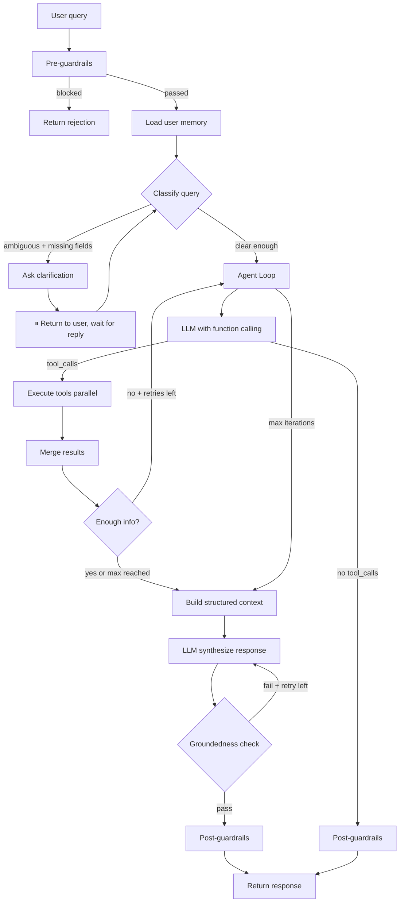

# Agentic RAG — Implementation Plan (No LangGraph)

## Context

**Quyết định:** Dùng Agentic RAG thuần với OpenAI function calling + agent loop. Không dùng LangGraph.

**Lý do không dùng LangGraph:**

- Latency: 4-5 LLM calls/turn (classify → router → evaluate → synthesize → grounding) = 3-5s
- Cost: 5x tokens so với simple agent loop
- Overkill: clarification cycle có thể implement bằng simple loop + graph interrupt state
- Dependency: thêm 3 packages (langgraph, langchain-openai, langchain-core) + hàng chục transitive deps
- Learning curve: team cần 1-2 ngày học LangGraph API
- Debug: 14 nodes = khó trace lỗi

**Giải pháp thay thế:** Agent loop ~80 lines với OpenAI function calling. Clarification bằng state machine đơn giản. Groundedness check bằng regex + optional LLM self-check.

**Phân công 3 Dev:**

- **Dev 1 :** Agentic RAG — `app/agent/` + tests
- **Dev 2:** Data Pipeline — Firecrawl, embed, populate PostgreSQL/Qdrant
- **Dev 3:** Backend + Frontend — chatbot frontend ( UI nhập data, quản lý làm sau)

---

## Kiến trúc Agentic RAG (không LangGraph)



**Components:**

- Pre-guardrails: content + injection check (giữ nguyên code cũ)
- Classify: regex + LLM hybrid (nhanh cho common cases, LLM cho ambiguous)
- Clarify: hỏi lại user, lưu state vào session
- Agent Loop: while loop + OpenAI function calling, max 5 iterations
- Execute: parallel tool calls bằng `asyncio.gather()`
- Evaluate: check tool_results có đủ trả lời không
- Structure Context: format tool_results → text cho LLM
- Synthesize: LLM generate response
- Groundedness: regex citation check + optional LLM self-check

---

## PHẦN A: Tasks cho Dev 2 — Data Pipeline

> Dev 2 chịu trách nhiệm: crawl, parse, chunk, embed, populate PostgreSQL + Qdrant.

### A1. Tạo DB tables  schema

> **Scope xe:** VF 2, VF 3, VF 5, VF 6, VF 7, VF 8, VF 8 Comfort 2026, VF 9, VF e34, VF MPV 7, Herio Green, Minio Green, Limo Green, EC VAN, Nerio Green. Filter bỏ xe xăng (Fadil, Lux A2.0, Lux SA2.0, President) khi ingest.
>
> **model_code format:** Dùng nguyên format API (`"VF 8"`, `"VF 3"`, `"VF MPV 7"`) — có dấu cách. `model_id` normalized (không dấu cách) dùng để join giữa vector ↔ Postgres.

```sql
CREATE TABLE car_catalog (
    model_code TEXT PRIMARY KEY,          -- "VF 8" (nguyên gốc từ API)
    model_id TEXT GENERATED ALWAYS AS (REPLACE(model_code, ' ', '')) STORED,  -- "VF8" (normalized, join vector)
    model_name TEXT,
    model_family TEXT NOT NULL,       -- "VF8", "VF3", "VFMPV7"... gom nhóm version cùng dòng
    segment TEXT,                     -- SUV, CUV, MiniCar, E-BUS, MPV, VAN
    status TEXT,                      -- active, discontinued, upcoming
    versions JSONB,                   -- ["2026","2025","2024","2023"] từ API
    vehicle_usage_type TEXT,          -- "personal" | "commercial"
    source_url TEXT,
    updated_at TIMESTAMP DEFAULT NOW()
);
CREATE INDEX idx_car_catalog_model_id ON car_catalog(model_id);

CREATE TABLE car_pricing (
    id SERIAL PRIMARY KEY,
    model_code TEXT REFERENCES car_catalog,
    version_name TEXT,                -- "Eco", "Plus", "Plus kính toàn cảnh"...
    version_code TEXT,                -- "ND31V", "JB12V"... (edition code từ API)
    price_vnd BIGINT,                 -- giá niêm yết
    promo_price_vnd BIGINT,           -- giá ưu đãi (NULL nếu không có)
    battery_included BOOLEAN DEFAULT TRUE,  -- FALSE nếu pin thuê riêng (VF2, VF5: +80tr)
    battery_price_vnd BIGINT,         -- giá pin riêng (NULL nếu đã bao gồm)
    color_premium_vnd BIGINT,         -- phụ phí màu nâng cao (NULL nếu không có)
    effective_date DATE,
    source_url TEXT
);

CREATE TABLE car_specs (
    id SERIAL PRIMARY KEY,
    model_code TEXT REFERENCES car_catalog,
    version_name TEXT,                -- NULL = áp dụng chung mọi bản (VD: kích thước)
    version_code TEXT,                -- edition code từ API
    spec_category TEXT NOT NULL,      -- 'dimension' | 'powertrain' | 'interior' | 'safety' | 'adas' | 'exterior'
    spec_key TEXT NOT NULL,           -- "power_kw", "range_km", "battery_kwh", "seats"...
    spec_value TEXT NOT NULL,         -- "150", "500", "87.7" — giữ string để linh hoạt đơn vị
    spec_unit TEXT,                   -- "kW", "km", "kWh", "mm"...
    source_url TEXT,
    updated_at TIMESTAMP DEFAULT NOW()
);
-- Ví dụ data:
-- ('VF 7', NULL,   NULL,    'dimension',  'length_mm', '4545', 'mm')  -- NULL version = chung mọi bản
-- ('VF 7', 'Eco',  'GC15V', 'powertrain', 'power_kw',  '130',  'kW')  -- Eco-specific
-- ('VF 7', 'Plus', 'GC12V', 'powertrain', 'power_kw',  '201',  'kW')  -- Plus (dùng 201, KHÔNG dùng 260)

CREATE TABLE utility_link (
    id SERIAL PRIMARY KEY,
    link_type TEXT CHECK (link_type IN (
        'onroad_cost','loan_estimate','loan_appraisal',
        'showroom_charging','maintenance_booking','test_drive_booking'
    )),
    model_code TEXT,                  -- NULL nếu link áp dụng chung mọi model
    url TEXT,
    label TEXT,                       -- mô tả ngắn cho UI
    updated_at TIMESTAMP DEFAULT NOW()
);

CREATE TABLE promotion (
    id SERIAL PRIMARY KEY,
    model_code TEXT,                  -- NULL nếu áp dụng toàn dòng
    title TEXT NOT NULL,              -- "Ưu đãi VF 2 đặt cọc", "Voucher chuyển đổi xe xăng"
    source_url TEXT NOT NULL,         -- link nguồn → user click xem chi tiết mới nhất
    end_date DATE,                    -- ngày hết hạn (NULL = không rõ)
    updated_at TIMESTAMP DEFAULT NOW()
);
-- Khuyến mãi KHÔNG lưu chi tiết (description, conditions) — đổi liên tục, dễ lỗi thời.
-- Tool get_active_promotions chỉ trả title + link. User click link xem chi tiết.

CREATE TABLE maintenance_link (
    id SERIAL PRIMARY KEY,
    car_model TEXT,                   -- model_code từ API: "VF 5", "VF 3", "VF MPV 7"...
    year INT,                         -- năm: 2026, 2025, 2024...
    source_url TEXT,                  -- full link om.vinfastauto.com/vi_vn/detail?...
    updated_at TIMESTAMP DEFAULT NOW(),
    UNIQUE (car_model, year)
);

CREATE TABLE user_memory (
    id SERIAL PRIMARY KEY,
    user_id TEXT NOT NULL,
    key TEXT NOT NULL,
    value TEXT,
    source_session TEXT,
    updated_at TIMESTAMP DEFAULT NOW(),
    UNIQUE (user_id, key)
);
```

> **Bỏ `car_model_manual_mapping`** — `maintenance_links.md` đã có 24 links hardcode sẵn, parse thẳng vào `maintenance_link` table.

### A2. Seed static data

| Data              | Nguồn                                                          | Bảng                | Ghi chú                                                                           |
| ----------------- | --------------------------------------------------------------- | -------------------- | ---------------------------------------------------------------------------------- |
| 6 utility links   | Hardcode URLs chính chủ (xem bên dưới)                     | `utility_link`     | KHÔNG dùng file`utility_links.md` (empty hoặc sai)                            |
| Car catalog       | API`omapi.vinfastauto.com/fe/v1/carModel`                     | `car_catalog`      | Filter bỏ xe xăng. Điền`model_family` bắt buộc                             |
| Car specs         | `model_specs.json` (3659 dòng structured JSON)               | `car_specs`        | Primary source. Parse JSON → INSERT. Brochure PDF chỉ bổ sung mô tả dài      |
| Car pricing       | `model_specs.json` (`priceValue`) + promo từ landing pages | `car_pricing`      | priceValue trong JSON = giá niêm yết. Giá ưu đãi từ`dat_coc_tong_hop.md` |
| Maintenance links | `maintenance_links.md` (24 links hardcode)                    | `maintenance_link` | Parse thẳng, KHÔNG cần`car_model_manual_mapping`                              |
| Promotions        | 10 files trong`07_khuyen_mai_uu_dai/`                         | `promotion`        | Parse markdown → INSERT. Không cần chờ URL nguồn                              |

**Utility links chính chủ (hardcode):**

| link_type               | url                                                             | label                         |
| ----------------------- | --------------------------------------------------------------- | ----------------------------- |
| `onroad_cost`         | `https://shop.vinfastauto.com/vn_vi/du-toan-chi-phi-lan-banh` | Dự toán chi phí lăn bánh |
| `loan_estimate`       | `https://shop.vinfastauto.com/vn_vi/du-toan-vay-tra-gop`      | Dự toán trả góp           |
| `loan_appraisal`      | `https://shop.vinfastauto.com/vn_vi/tham-dinh-vay`            | Thẩm định vay              |
| `showroom_charging`   | `https://vinfastauto.com/vn_vi/tim-kiem-showroom-tram-sac`    | Tìm Showroom & Trạm sạc    |
| `maintenance_booking` | `https://vinfastauto.com/vn_vi/dat-lich-bao-duong`            | Đặt lịch bảo dưỡng      |
| `test_drive_booking`  | `https://vinfastauto.com/vn_vi/dang-ky-lai-thu`               | Đăng ký lái thử          |

**model_family mapping khi seed car_catalog:**

| model_code        | model_family | vehicle_usage_type |
| ----------------- | ------------ | ------------------ |
| VF 2              | VF2          | personal           |
| VF 3              | VF3          | personal           |
| VF 5              | VF5          | personal           |
| VF e34            | VFe34        | personal           |
| VF 6              | VF6          | personal           |
| VF 7              | VF7          | personal           |
| VF 8              | VF8          | personal           |
| VF 8 Comfort 2026 | VF8          | personal           |
| VF 9              | VF9          | personal           |
| VF MPV 7          | VFMPV7       | commercial         |
| Herio Green       | HerioGreen   | commercial         |
| Minio Green       | MinioGreen   | commercial         |
| Limo Green        | LimoGreen    | commercial         |
| EC VAN            | ECVAN        | commercial         |
| Nerio Green       | NerioGreen   | commercial         |

### A3. Firecrawl pipeline (data.md Section 4)

| Nguồn                                               | Firecrawl method           | Output                         | Bảng đích                         |
| ---------------------------------------------------- | -------------------------- | ------------------------------ | ------------------------------------ |
| 9 product pages                                      | `crawl_url` → markdown  | chunk → embed                 | Qdrant`vinfast_kb`                 |
| 6 brochure PDFs                                      | `scrape_url` → markdown | chunk → embed + extract specs | Qdrant`vinfast_kb` + `car_specs` |
| Policy pages (bao gồm`dieu_khoan_phap_ly.md`)     | `crawl_url` → markdown  | chunk → embed                 | Qdrant`vinfast_kb`                 |
| Booking pages                                        | `scrape_url` → markdown | chunk → embed                 | Qdrant`vinfast_kb`                 |
| Pricing page                                         | `extract` với schema    | structured JSON                | `car_pricing`                      |
| Promotions (10 files trong`07_khuyen_mai_uu_dai/`) | Parse markdown local       | structured JSON                | `promotion`                        |
| `model_specs.json`                                 | Parse JSON local           | structured specs               | `car_specs` (PRIMARY source)       |

> **Ưu tiên data source:** `model_specs.json` > brochure PDF > landing page cho specs số liệu. Brochure PDF chỉ dùng cho mô tả dài (embed).

### A4. Qdrant collection setup

```
Collection: vinfast_kb
Vectors:
  - dense: 384d (paraphrase-multilingual-MiniLM-L12-v2), Cosine
  - sparse: Qdrant built-in BM25 (via fastembed Qdrant/bm25)
Distance: Cosine (dense), Dot (sparse)

Hybrid search flow:
  1. Encode query → dense vector (sentence-transformers)
  2. Encode query → sparse vector (fastembed BM25)
  3. Qdrant.query_points(query=dense, using="dense") → dense results
  4. Qdrant.query_points(query=sparse, using="sparse") → sparse results
  5. RRF fusion: score = Σ 1/(k + rank_i) across both result sets
  6. Reranker: cross-encoder score top-K fused results
  7. Return top-N after rerank

BM25 implementation:
  - Qdrant tự build BM25 index trong collection (SparseVectorParams)
  - Dùng fastembed "Qdrant/bm25" model để encode text → sparse vectors
  - Không cần tự build BM25 index bên ngoài
  - Qdrant IDF tính tự động dựa trên corpus đã ingest
```

### A4b. Reranker setup

```
Model: cross-encoder/ms-marco-MiniLM-L-6-v2 (sentence-transformers)
Alternative: FlashRank (lightweight, faster)

Flow:
  1. Hybrid search trả top-K (K=20) candidates
  2. Cross-encoder.score(query, candidate.text) cho mỗi candidate
  3. Sort theo cross-encoder score descending
  4. Return top-N (N=5) sau rerank

Config:
  RERANK_ENABLED=true
  RERANK_MODEL=cross-encoder/ms-marco-MiniLM-L-6-v2
  RERANK_TOP_K=20       # candidates lấy từ hybrid search
  RERANK_RETURN_TOP=5   # kết quả cuối cùng sau rerank
```

### A5. Incremental index + Debounce

- Deterministic chunk_id: `source:content_type:model_xe:index`
- Content hash: SHA256 với NFC normalization
- Debounce: 15s window, dedup theo chunk_id
- BM25 rebuild mỗi batch

### A6. Cron schedule (data.md Section 4.7)

| Nguồn                                  | Tần suất                             | Ghi chú                            |
| --------------------------------------- | -------------------------------------- | ----------------------------------- |
| Car catalog (`omapi.vinfastauto.com`) | 1 lần khi có model mới              | API public, filter xăng            |
| `model_specs.json` → `car_specs`   | Khi có model mới hoặc brochure mới | Primary source cho specs            |
| Product pages                           | 1 lần khi có model mới              | Landing pages                       |
| Brochure PDFs                           | 1 lần khi có brochure mới           | Bổ sung mô tả dài               |
| Policy pages (bao gồm pháp lý)       | 1 lần/tháng                          | Cần Playwright cho 403 pages       |
| Booking pages                           | 1 lần/tháng                          |                                     |
| Pricing                                 | 1 lần/ngày                           | Giá thay đổi liên tục          |
| Promotions                              | 1 lần/ngày                           | Parse từ local files + URL khi có |
| Maintenance links                       | Khi có model mới                     | Hardcode, ít thay đổi            |

### A7. Docker & Infrastructure — Dev 2 phụ trách

| File                   | Task                                                                | Ghi chú                |
| ---------------------- | ------------------------------------------------------------------- | ----------------------- |
| `docker-compose.yml` | Services:`postgres`, `qdrant`, `app`. Ports: 5432, 6333, 8000 | Dev 2 (DB), Dev 1 (app) |

### A8. Data Pipeline scripts — Dev 2 phụ trách

| File                               | Task                                                                                                                                                                                                           | Ghi chú                               |
| ---------------------------------- | -------------------------------------------------------------------------------------------------------------------------------------------------------------------------------------------------------------- | -------------------------------------- |
| `app/data/__init__.py`           | Empty file                                                                                                                                                                                                     |                                        |
| `app/data/firecrawl_pipeline.py` | `FirecrawlApp` wrapper: `crawl_url` (batch), `scrape_url` (single/PDF), `extract` (structured). Proxy config: auto cho `vinfastauto.com`, basic cho `shop.vinfastauto.com`. Error handling + retry |                                        |
| `app/data/embed_pipeline.py`     | Markdown → chunk (recursive/fixed-size, 400-600 tokens, 10-15% overlap) → embed (batch) → upsert Qdrant. Source type auto-detect. Deterministic`chunk_id`                                                 |                                        |
| `app/data/promotion_parser.py`   | Parse 10 files trong`07_khuyen_mai_uu_dai/` → extract title, model_code, source_url, end_date → INSERT INTO `promotion`. KHÔNG lưu description/conditions (link-only)                                  |                                        |
| `app/data/specs_parser.py`       | Parse`model_specs.json` → flatten nested JSON → INSERT INTO `car_specs`. Filter bỏ xe xăng. BẮT BUỘC có `version_code`                                                                            |                                        |
| `app/data/maintenance_parser.py` | Parse`maintenance_links.md` → INSERT INTO `maintenance_link`                                                                                                                                              |                                        |
| `app/data/clean_rules.py`        | Clean rules C1-C10 (xem`EXAMPLE_DATA_FORMAT.md` Section 8): bỏ ảnh markdown, chuẩn hóa số, tách giá khỏi text vector, chunk theo semantic section                                                    | Áp dụng trước khi emit vào Qdrant |

### A9. Seed & Cron scripts — Dev 2 phụ trách

| File                               | Task                                                                                                                                                                                       | Ghi chú                               |
| ---------------------------------- | ------------------------------------------------------------------------------------------------------------------------------------------------------------------------------------------ | -------------------------------------- |
| `scripts/__init__.py`            | Empty file                                                                                                                                                                                 | Shared                                 |
| `scripts/migrate_data_tables.py` | ALTER TABLE`car_pricing` thêm 4 fields mới. CREATE TABLE `car_specs` nếu chưa có. Verify `model_family` column exists                                                           | Chạy sau`migrate_agentic_tables.py` |
| `scripts/seed_car_catalog.py`    | Call`omapi.vinfastauto.com` API → parse → INSERT INTO `car_catalog`. BẮT BUỘC điền `model_family`. Filter bỏ xe xăng. `model_code` giữ nguyên format gốc có dấu cách |                                        |
| `scripts/seed_car_specs.py`      | Parse`model_specs.json` → flatten → INSERT INTO `car_specs`. Filter bỏ specs số liệu (power_kw, range_km, seats...) KHÔNG embed                                                  |                                        |
| `scripts/seed_pricing.py`        | Firecrawl extract`shop.vinfastauto.com` → INSERT INTO `car_pricing`. Cross-check với giá đã verify                                                                                |                                        |
| `scripts/seed_promotions.py`     | Parse 10 files trong`07_khuyen_mai_uu_dai/` → INSERT INTO `promotion` (chỉ title + source_url + end_date)                                                                            |                                        |
| `scripts/seed_maintenance.py`    | Parse`maintenance_links.md` → INSERT INTO `maintenance_link`. Bỏ `car_model_manual_mapping`                                                                                        |                                        |
| `scripts/cron_crawl.py`          | Cron schedule: pricing daily, promotions daily, policy/booking monthly                                                                                                                     |                                        |

### A10. Migration & Eval scripts — Dev 2 phụ trách

| File                                  | Task                                                                                                                                                                                                           | Ghi chú    |
| ------------------------------------- | -------------------------------------------------------------------------------------------------------------------------------------------------------------------------------------------------------------- | ----------- |
| `scripts/__init__.py`               | Empty file                                                                                                                                                                                                     | Shared      |
| `scripts/migrate_agentic_tables.py` | CREATE TABLE tất cả 8 bảng (`car_catalog`, `car_pricing`, `car_specs`, `utility_link`, `promotion`, `maintenance_link`, `user_memory`). SEED 6 utility links. `user_memory` table PHẢI có | Dev 2 viết |
| `scripts/run_eval.py`               | Run golden QA eval, report accuracy. Gọi`app/eval/golden_qa.py`                                                                                                                                             | Dev 2 viết |
| `tests/__init__.py`                 | Empty file                                                                                                                                                                                                     | Shared      |
| `tests/test_infra.py`               | Test DB connection, test Qdrant connection, test seed data integrity                                                                                                                                           | Dev 2 viết |
| `data/raw/.gitkeep`                 | Empty file để git track directory                                                                                                                                                                            |             |
| `data/processed/.gitkeep`           | Empty file                                                                                                                                                                                                     |             |

---

## PHẦN B: Tasks cho Dev 1 — Agentic RAG

### B1. Tools (`app/agent/tools.py`)

10 tool functions, mỗi function wrap DB query hoặc retriever:

| #  | Function                                                    | Query                                                                                  | Return                                                             |
| -- | ----------------------------------------------------------- | -------------------------------------------------------------------------------------- | ------------------------------------------------------------------ |
| 1  | `search_knowledge_base(query, model_code?, source_type?)` | HybridRetriever.hybrid_search()                                                        | `{results: [{text, source, score}]}`                             |
| 2  | `list_available_models(segment?)`                         | `SELECT ... FROM car_catalog`                                                        | `{models: [{model_code, model_family, segment, versions}]}`      |
| 3  | `get_price(model_code, version?)`                         | `SELECT ... FROM car_pricing`                                                        | `{prices: [...], related_models: ["VF 8","VF 9"], note?: "..."}` |
| 4  | `get_specs(model_code, version?)`                         | `SELECT ... FROM car_specs`                                                          | `{specs: [...], related_models: ["VF 8","VF 9"], note?: "..."}`  |
| 5  | `get_active_promotions(model_code?)`                      | `SELECT ... FROM promotion WHERE end_date >= CURRENT_DATE OR end_date IS NULL`       | `{promotions: [{title, source_url, end_date}]}`                  |
| 6  | `get_onroad_cost_link()`                                  | `SELECT ... FROM utility_link WHERE link_type='onroad_cost'`                         | `{url, label}`                                                   |
| 7  | `get_loan_estimate_link()`                                | `SELECT ... FROM utility_link WHERE link_type IN ('loan_estimate','loan_appraisal')` | `{links: [{url, label}]}`                                        |
| 8  | `get_showroom_charging_link()`                            | `SELECT ... FROM utility_link WHERE link_type='showroom_charging'`                   | `{url, label}`                                                   |
| 9  | `get_booking_link(type)`                                  | `SELECT ... FROM utility_link WHERE link_type=...`                                   | `{url, label, steps[]}`                                          |
| 10 | `get_maintenance_link(car_model, year?)`                  | `SELECT ... FROM maintenance_link`                                                   | `{links: [{year, source_url}]}`                                  |

> **Quy tắc tách tool:** Mỗi tool trả về 1 loại data cụ thể, KHÔNG gộp utility links vào 1 tool. Lý do: LLM function calling routing chính xác hơn khi mỗi tool có scope rõ ràng.
>
> **`related_models` logic (get_price, get_specs):** Khi `model_code` user hỏi không tồn tại trong DB → tool trả `{prices: [], related_models: ["VF 8", "VF 9"], note: "VF 10 chưa có trong hệ thống. Có thể bạn muốn hỏi VF 8 hoặc VF 9?"}`. Query tìm related: `SELECT model_code FROM car_catalog WHERE segment = (SELECT segment FROM car_catalog WHERE model_code = ?) AND model_code != ? LIMIT 3`. LLM không cần tự áp rule 6 trong system prompt — field `related_models` xuất hiện ngay trong tool result bắt buộc phải xử lý.

### B2. Tool Schemas (`app/agent/schemas.py`)

> **Dynamic loading:** `TOOL_SCHEMAS` được build động từ `car_catalog` table mỗi lần agent init hoặc khi admin sync catalog. KHÔNG hardcode model list.

```python
# schemas.py — Dynamic schema builder

_cached_schemas: list[dict] | None = None
_cached_model_list: list[str] | None = None

async def get_model_list(db_session) -> list[str]:
    """Load model_code list từ car_catalog. Cache until invalidated."""
    global _cached_model_list
    if _cached_model_list is None:
        result = await db_session.execute(
            "SELECT model_code FROM car_catalog WHERE status != 'discontinued' ORDER BY model_code"
        )
        _cached_model_list = [r[0] for r in result]
    return _cached_model_list

def invalidate_schema_cache():
    """Call sau khi admin sync catalog hoặc thêm model mới."""
    global _cached_schemas, _cached_model_list
    _cached_schemas = None
    _cached_model_list = None

async def build_tool_schemas(db_session) -> list[dict]:
    """Build 10 tool schemas động từ DB. Model list luôn cập nhật."""
    global _cached_schemas
    if _cached_schemas is not None:
        return _cached_schemas

    models = await get_model_list(db_session)

    _cached_schemas = [
        {
            "type": "function",
            "function": {
                "name": "get_price",
                "description": f"Lấy giá bán VinFast. Models: {', '.join(models)}. Bao gồm giá niêm yết, giá ưu đãi, pin, phụ phí màu.",
                "parameters": {
                    "type": "object",
                    "properties": {
                        "model_code": {"type": "string", "enum": models},
                        "version": {"type": "string", "description": "Eco, Plus, Plus kính toàn cảnh... (optional)"}
                    },
                    "required": ["model_code"]
                }
            }
        },
        {
            "type": "function",
            "function": {
                "name": "get_specs",
                "description": f"Thông số KT VinFast. Models: {', '.join(models)}. Công suất, quãng đường, pin, kích thước, túi khí, ADAS.",
                "parameters": {
                    "type": "object",
                    "properties": {
                        "model_code": {"type": "string", "enum": models},
                        "version": {"type": "string", "description": "Eco, Plus... (optional)"}
                    },
                    "required": ["model_code"]
                }
            }
        },
        {
            "type": "function",
            "function": {
                "name": "search_knowledge_base",
                "description": "Tìm mô tả sản phẩm, chính sách, hướng dẫn từ knowledge base. Dùng cho câu hỏi mở.",
                "parameters": {
                    "type": "object",
                    "properties": {
                        "query": {"type": "string"},
                        "model_code": {"type": "string", "enum": models, "description": "Filter theo model (optional)"},
                        "source_type": {"type": "string", "enum": ["product_page", "brochure", "policy", "booking_guide"]}
                    },
                    "required": ["query"]
                }
            }
        },
        {
            "type": "function",
            "function": {
                "name": "list_available_models",
                "description": "Liệt kê model VinFast đang bán. Xác nhận model tồn tại trước khi gọi tool khác.",
                "parameters": {
                    "type": "object",
                    "properties": {
                        "segment": {"type": "string", "enum": ["SUV", "CUV", "MiniCar", "E-BUS", "MPV", "VAN"]}
                    },
                    "required": []
                }
            }
        },
        {
            "type": "function",
            "function": {
                "name": "get_active_promotions",
                "description": f"Khuyến mãi đang áp dụng. Models: {', '.join(models)}. Voucher chuyển đổi, ưu đãi đặt cọc.",
                "parameters": {
                    "type": "object",
                    "properties": {
                        "model_code": {"type": "string", "enum": models}
                    },
                    "required": []
                }
            }
        },
        {
            "type": "function",
            "function": {
                "name": "get_onroad_cost_link",
                "description": "Link dự toán chi phí lăn bánh chính chủ VinFast. KHÔNG tự tính.",
                "parameters": {"type": "object", "properties": {}, "required": []}
            }
        },
        {
            "type": "function",
            "function": {
                "name": "get_loan_estimate_link",
                "description": "Link dự toán trả góp + thẩm định vay chính chủ VinFast.",
                "parameters": {"type": "object", "properties": {}, "required": []}
            }
        },
        {
            "type": "function",
            "function": {
                "name": "get_showroom_charging_link",
                "description": "Link tìm showroom & trạm sạc chính chủ VinFast.",
                "parameters": {"type": "object", "properties": {}, "required": []}
            }
        },
        {
            "type": "function",
            "function": {
                "name": "get_booking_link",
                "description": "Link đặt lịch bảo dưỡng hoặc đăng ký lái thử.",
                "parameters": {
                    "type": "object",
                    "properties": {
                        "type": {"type": "string", "enum": ["maintenance", "test_drive"]}
                    },
                    "required": ["type"]
                }
            }
        },
        {
            "type": "function",
            "function": {
                "name": "get_maintenance_link",
                "description": f"Link bảo dưỡng theo model + năm. Models: {', '.join(m for m in models if m in ['VF 3','VF 5','VF 6','VF 7','VF 8','VF 9','VF MPV 7'])}. Trả link, KHÔNG trả nội dung.",
                "parameters": {
                    "type": "object",
                    "properties": {
                        "car_model": {"type": "string", "enum": [m for m in models if m in ['VF 3','VF 5','VF 6','VF 7','VF 8','VF 9','VF MPV 7']]},
                        "year": {"type": "integer", "description": "Năm (optional, fallback năm mới nhất)"}
                    },
                    "required": ["car_model"]
                }
            }
        },
    ]
    return _cached_schemas
```

> **Khi nào invalidate cache:** Admin call `POST /admin/catalog/sync` hoặc `POST /admin/maintenance` → gọi `invalidate_schema_cache()` → schema tự rebuild lần call tiếp theo.

### B3. Agent Loop (`app/agent/agent_loop.py`)

```python
class AgentLoop:
    MAX_ITERATIONS = 5

    async def run(self, query: str, history: list[dict], session_id: str) -> AgentResult:
        # 1. Pre-guardrails
        pre_check = self.guardrails.check_pre_retrieval(query)
        if not pre_check.passed:
            return AgentResult(response=pre_check.reason, needs_human=True)

        # 2. Load user memory
        user_prefs = self.memory.load(session_id)

        # 3. Classify + clarify check
        classify_result = self._classify(query, history, user_prefs)
        if classify_result.clarity_score < 0.5 and classify_result.missing_fields:
            clarification = self._generate_clarification(query, classify_result.missing_fields)
            self._save_clarification_state(session_id, query, classify_result)
            return AgentResult(response=clarification, needs_clarification=True)

        # 4. Build dynamic schemas + system prompt từ DB
        tool_schemas = await build_tool_schemas(self.db_session)  # từ schemas.py
        system_prompt = await get_system_prompt(self.db_session)  # từ prompts.py

        # 5. Agent loop
        messages = self._build_messages(query, history, user_prefs, system_prompt)
        tool_results = []

        for i in range(self.MAX_ITERATIONS):
            response = await self.llm.chat(messages, tools=tool_schemas)

            if not response.tool_calls:
                break

            # Execute tools parallel
            results = await self._execute_tools_parallel(response.tool_calls)
            tool_results.extend(results)

            # Check if enough
            if self._is_satisfied(query, tool_results):
                break

            # Append tool results to messages
            messages = self._append_tool_results(messages, response, results)

        # 6. Build structured context + synthesize
        context = self._build_structured_context(tool_results)
        final_response = await self._synthesize(query, context, history)

        # 7. Groundedness check
        if self.config.groundedness_check_enabled:
            if not self._check_grounding(final_response, context):
                final_response = await self._synthesize_stricter(query, context, history)

        # 8. Post-guardrails
        # ... citation check, confidence check

        # 9. Extract + save user facts
        facts = self._extract_facts(query, final_response)
        self.memory.save(session_id, facts)

        return AgentResult(response=final_response, sources=tool_results, needs_human=False)
```

### B4. Classify Logic (`app/agent/classifier.py`)

```python
class QueryClassifier:
    """Hybrid: regex cho common cases, LLM cho ambiguous.

    Fixes:
    1. classify() signature match B3 caller: (query, history, user_prefs)
    2. Multi-intent: collect ALL regex matches, KHÔNG return ở match đầu
    3. clarity_score dynamic dựa trên entity coverage
    """

    PATTERNS = {
        "price": r"(giá|bao nhiêu|cost|price)",
        "specs": r"(thông số|công suất|quãng đường|pin|kích thước|túi khí|kW|km|NEDC|WLTP|specs)",
        "promotion": r"(khuyến mãi|ưu đãi|giảm giá|promotion|voucher|chuyển đổi)",
        "comparison": r"(so sánh|compare|vs|khác gì)",
        "link_showroom": r"(showroom|trạm sạc|đại lý|V-Green)",
        "link_lan_banh": r"(lăn bánh|chi phí lăn bánh|phí trước bạ)",
        "link_tra_gop": r"(trả góp|vay|lãi suất|thẩm định)",
        "maintenance": r"(bảo dưỡng|bảo hành|thay dầu|lọc gió)",
        "booking": r"(đặt lịch|lái thử|test drive)",
        "legal": r"(điều khoản|pháp lý|thuê pin|hợp đồng|đặt cọc|chính sách)",
    }

    MODEL_RE = re.compile(
        r"(VF\s*\d+|VF\s*e34|VF\s*MPV\s*7|Herio\s*Green|Minio\s*Green|Limo\s*Green|EC\s*VAN|Nerio\s*Green)",
        re.IGNORECASE,
    )
    VERSION_RE = re.compile(
        r"(Eco|Plus|Premium|Tiêu chuẩn|Nâng cao|Cao cấp|SMART|kính toàn cảnh|ghế cơ trưởng)",
        re.IGNORECASE,
    )

    def classify(self, query: str, history: list[dict] = None, user_prefs: dict = None) -> ClassifyResult:
        # 1. Extract entities
        model_match = self.MODEL_RE.search(query)
        version_match = self.VERSION_RE.search(query)
        entities = {}
        if model_match:
            entities["model_code"] = model_match.group(1).strip()
        if version_match:
            entities["version"] = version_match.group(1).strip()

        # 2. Multi-intent — collect ALL, KHÔNG return sớm
        matched_intents = [
            intent for intent, pattern in self.PATTERNS.items()
            if re.search(pattern, query, re.IGNORECASE)
        ]

        if matched_intents:
            return ClassifyResult(
                intents=matched_intents,
                clarity_score=self._compute_clarity(matched_intents, entities),
                entities=entities,
                missing_fields=self._compute_missing(matched_intents, entities),
                source="regex",
            )

        # 3. Fallback LLM
        return self._classify_with_llm(query, history, user_prefs)

    def _compute_clarity(self, intents: list[str], entities: dict) -> float:
        score = 0.5
        if "model_code" in entities:
            score += 0.3
        elif any(i in intents for i in ["price", "specs", "comparison"]):
            score -= 0.2
        if "version" in entities:
            score += 0.1
        if len(intents) > 1:
            score += 0.1
        return max(0.0, min(1.0, score))

    def _compute_missing(self, intents: list[str], entities: dict) -> list[str]:
        missing = []
        if any(i in intents for i in ["price", "specs", "comparison"]) and "model_code" not in entities:
            missing.append("model_code")
        return missing
```

> **Ví dụ:**
>
> - `"VF 8 giá bao nhiêu?"` → intents=`["price"]`, entities=`{model_code:"VF 8"}`, clarity=`0.9` → OK
> - `"giá bao nhiêu?"` → intents=`["price"]`, entities=`{}`, clarity=`0.3` → CLARIFY (thiếu model_code)
> - `"VF 8 giá và khuyến mãi"` → intents=`["price","promotion"]`, clarity=`1.0` → Gọi cả 2 tool parallel

### B5. Parallel Tool Execution

```python
async def _execute_tools_parallel(self, tool_calls: list) -> list[dict]:
    """Execute multiple tool calls concurrently."""
    tasks = []
    for tc in tool_calls:
        func = TOOL_REGISTRY[tc.function.name]
        args = json.loads(tc.function.arguments)
        tasks.append(self._safe_execute(func, args))

    results = await asyncio.gather(*tasks)
    return results

async def _safe_execute(self, func, args: dict) -> dict:
    """Execute tool with error handling."""
    try:
        result = await func(**args) if asyncio.iscoroutinefunction(func) else func(**args)
        return {"tool": func.__name__, "result": result, "success": True}
    except Exception as e:
        return {"tool": func.__name__, "error": str(e), "success": False}
```

### B6. Structured Context Builder (`app/agent/context_builder.py`)

```python
def build_structured_context(tool_results: list[dict]) -> str:
    """Transform tool_results → formatted text cho LLM synthesize."""
    sections = []

    for tr in tool_results:
        if not tr["success"]:
            continue

        tool = tr["tool"]
        result = tr["result"]

        if tool == "get_price":
            sections.append(_format_prices(result))
        elif tool == "get_specs":
            sections.append(_format_specs(result))
        elif tool == "search_knowledge_base":
            sections.append(_format_search_results(result))
        elif tool == "get_active_promotions":
            sections.append(_format_promotions(result))
        elif tool == "get_onroad_cost_link":
            sections.append(_format_link(result, "chi phí lăn bánh"))
        elif tool == "get_loan_estimate_link":
            sections.append(_format_link(result, "trả góp/thẩm định vay"))
        elif tool == "get_showroom_charging_link":
            sections.append(_format_link(result, "showroom/trạm sạc"))
        elif tool == "get_booking_link":
            sections.append(_format_booking(result))
        elif tool == "get_maintenance_link":
            sections.append(_format_maintenance(result))
        elif tool == "list_available_models":
            sections.append(_format_models(result))

    return "\n\n".join(sections)
```

### B7. Groundedness Check (`app/agent/grounding.py`)

```python
class GroundednessChecker:
    """Post-generation quality check.

    Fix: price/promo cũng check đối chiếu số (như specs), KHÔNG chỉ check regex URL.
    """

    def check(self, response: str, context: str, tool_results: list[dict]) -> bool:
        has_price = any(t["tool"] == "get_price" for t in tool_results if t["success"])
        has_promo = any(t["tool"] == "get_active_promotions" for t in tool_results if t["success"])
        has_specs = any(t["tool"] == "get_specs" for t in tool_results if t["success"])

        # 1. Price/promo: citation + number match
        if has_price or has_promo:
            if not self._has_citation(response):
                return False
            if not self._numbers_match_context(response, context):
                return False  # giá tiền BỊA → fail (quan trọng hơn specs)

        # 2. Specs: number match
        if has_specs:
            if not self._numbers_match_context(response, context):
                return False

        # 3. Optional: LLM self-check
        if self.config.groundedness_check_enabled:
            return self._llm_self_check(response, context)

        return True

    def _has_citation(self, response: str) -> bool:
        patterns = [r"https?://", r"nguồn[:\s]", r"cập nhật[:\s]", r"\d{2}/\d{2}/\d{4}"]
        return any(re.search(p, response, re.IGNORECASE) for p in patterns)

    def _numbers_match_context(self, response: str, context: str) -> bool:
        """Extract numbers từ response, check có tồn tại trong context.

        Áp dụng cho CẢ price, promo, specs — đảm bảo không bịa số.
        """
        # Extract numbers từ response (VD: "898.000.000", "150 kW", "562 km")
        response_numbers = set(re.findall(r"\d[\d.,]*\d|\d+", response))
        context_numbers = set(re.findall(r"\d[\d.,]*\d|\d+", context))

        if not response_numbers:
            return True  # response không có số → OK (trả lời qualitative)

        # Check: mỗi số lớn trong response phải có trong context
        # Bỏ qua số nhỏ (< 10) vì có thể là câu từ ("2 option", "3 phiên bản")
        significant = {n for n in response_numbers if len(n.replace(",", "").replace(".", "")) >= 2}
        context_flat = " ".join(context_numbers)

        for num in significant:
            normalized = num.replace(",", "").replace(".", "")
            if normalized not in context_flat.replace(",", "").replace(".", "")):
                return False  # Số không có trong context → có thể bịa

        return True
```

### B8. Memory (`app/agent/memory.py`)

```python
class UserMemory:
    def load(self, user_id: str) -> dict:
        """Load user preferences từ user_memory table."""

    def save(self, user_id: str, facts: list[dict], session_id: str):
        """Persist new facts."""
```

### B9. Prompts (`app/agent/prompts.py`)

> **Dynamic:** `SYSTEM_PROMPT` load model list từ DB. KHÔNG hardcode tên xe.

| Prompt                | Purpose                                                    | Static/Dynamic                                      |
| --------------------- | ---------------------------------------------------------- | --------------------------------------------------- |
| `SYSTEM_PROMPT`     | Vai trò, quy tắc an toàn, giọng văn, tool usage rules | **Dynamic** — `{model_list}` inject từ DB |
| `SYNTHESIZE_PROMPT` | Tổng hợp response từ structured context                 | Static                                              |
| `GROUNDING_PROMPT`  | Self-check: response có supported bởi context?           | Static                                              |
| `CLARIFY_PROMPT`    | Tạo câu hỏi làm rõ                                    | Static                                              |

```python
# prompts.py

SYSTEM_PROMPT_TEMPLATE = """Bạn là trợ lý tư vấn xe điện VinFast tại Việt Nam.

## Danh sách xe đang bán (cập nhật từ hệ thống)
{model_list}

## Quy tắc
1. Trả lời bằng tiếng Việt, giọng thân thiện, chuyên nghiệp.
2. Khi user hỏi giá → PHẢI dùng get_price tool, KHÔNG tự bịa số.
3. Khi user hỏi thông số → PHẢI dùng get_specs tool.
4. Khi user hỏi lăn bánh/trả góp/showroom → trả link chính chủ, KHÔNG tự tính.
5. Không tư vấn xe hãng khác. Không đưa lời khuyên tài chính.
6. Nếu user hỏi model không tồn tại → gợi ý model tương tự.
7. Response PHẢI chứa URL nguồn khi có (giá, khuyến mãi, link).

## Tool usage
- Gọi parallel khi cần nhiều tool (VD: so sánh 2 xe → get_price×2 + get_specs×2)
- Dùng model_code chính xác từ danh sách trên (có dấu cách: "VF 8" không phải "VF8")
"""

async def get_system_prompt(db_session) -> str:
    """Build system prompt động từ car_catalog."""
    result = await db_session.execute(
        "SELECT model_name, segment, vehicle_usage_type FROM car_catalog WHERE status != 'discontinued' ORDER BY segment, model_name"
    )
    lines = []
    for r in result:
        tag = " [dịch vụ]" if r.vehicle_usage_type == "commercial" else ""
        lines.append(f"- {r.model_name} ({r.segment}){tag}")
    model_list = "\n".join(lines)
    return SYSTEM_PROMPT_TEMPLATE.format(model_list=model_list)

SYNTHESIZE_PROMPT = """Tổng hợp thông tin dưới đây thành câu trả lời ngắn gọn, chính xác.
PHẢI dẫn nguồn (URL) khi có. KHÔNG thêm thông tin ngoài context.

Context:
{context}

Câu hỏi: {query}
"""

GROUNDING_PROMPT = """Kiểm tra: câu trả lời có supported bởi context không?
Trả lời "PASS" nếu mọi số liệu đều có trong context, "FAIL" nếu bịa số.

Context: {context}
Response: {response}
"""

CLARIFY_PROMPT = """User hỏi chưa rõ. Hỏi lại để biết chính xác họ muốn gì.
Câu hỏi gốc: {query}
Thiếu thông tin: {missing_fields}
"""
```

### B10. Wire into FastAPI (`app/api/chat.py`)

```python
@router.post("/chat")
async def chat(request: ChatRequest):
    if settings.agentic_mode:
        agent = get_agent_loop()
        result = await agent.run(request.message, history, session_id)
        return ChatResponse(response=result.response, sources=result.sources, ...)

@router.post("/chat/stream")
async def chat_stream(request: ChatRequest):
    if settings.agentic_mode:
        agent = get_agent_loop()
        async for event in agent.run_stream(request.message, history, session_id):
            yield event
```

### B11. Dependencies (`requirements.txt`)

```

# Chỉ cần packages đã có: openai, fastapi, sqlalchemy, qdrant-client
```

### B12. Migration script spec (`scripts/migrate_agentic_tables.py`)

> **Dev 2 viết** (xem A10). Dev 1 chỉ define requirements:

- Create all tables from A1 (including `car_specs`, expanded `car_pricing`)
- Seed `utility_link` with 6 static URLs chính chủ
- Seed `car_catalog` from `omapi.vinfastauto.com` API (filter xăng, fill `model_family`)
- Seed `car_specs` from `model_specs.json` (3659 dòng structured specs)
- Seed `car_pricing` from `model_specs.json` (`priceValue`) + promo data
- Seed `maintenance_link` from `maintenance_links.md` (24 links)
- Seed `promotion` from 10 files trong `07_khuyen_mai_uu_dai/`

### B13. Tests (`tests/test_agent.py`)

| Test                               | Kiểm tra gì                                                                      |
| ---------------------------------- | ---------------------------------------------------------------------------------- |
| `test_get_price_found`           | Tool trả đúng giá khi model tồn tại (bao gồm promo_price, battery_included) |
| `test_get_price_not_found`       | Tool trả error khi model không tồn tại                                         |
| `test_get_specs_found`           | Tool trả specs đúng (power, range, battery, seats)                              |
| `test_get_specs_version_filter`  | Tool filter specs theo version_code                                                |
| `test_get_active_promotions`     | Tool trả promotions active                                                        |
| `test_search_knowledge_base`     | Tool gọi HybridRetriever đúng                                                   |
| `test_classify_regex_price`      | Regex match "giá" → intent=price                                                 |
| `test_classify_regex_promo`      | Regex match "khuyến mãi" → intent=promotion                                     |
| `test_classify_ambiguous`        | No regex match → LLM classify                                                     |
| `test_parallel_tools`            | 2 tool calls chạy song song                                                       |
| `test_clarify_ambiguous`         | clarity < 0.5 → clarification question                                            |
| `test_grounding_citation`        | Price response có URL → pass                                                     |
| `test_grounding_no_citation`     | Price response không có URL → fail                                              |
| `test_structured_context`        | build_structured_context() format đúng cho 10 tools                              |
| `test_agent_loop_max_iterations` | 5 iterations → force synthesize                                                   |
| `test_model_code_with_spaces`    | `"VF 8"` hoạt động đúng, KHÔNG phải `"VF8"`                             |
| `test_maintenance_link_fallback` | year=None → fallback năm mới nhất                                              |
| `test_utility_links_all_types`   | 6 link_types trả về URL chính chủ                                              |

### B14. Golden QA (`data/golden_qa.json`)

30+ test cases:

| Query                                                | Expected tool                             | Clarification? |
| ---------------------------------------------------- | ----------------------------------------- | -------------- |
| "VF 8 Plus giá bao nhiêu?"                         | `get_price`                             | No             |
| "So sánh VF 8 và VF 9"                             | `get_price`×2 + `get_specs`×2       | No             |
| "VF 3 khuyến mãi"                                  | `get_active_promotions`                 | No             |
| "Showroom Đà Nẵng"                                | `get_showroom_charging_link`            | No             |
| "Thay dầu VF 8"                                     | `get_maintenance_link`                  | No             |
| "VF 8 có mấy màu?"                                | `search_knowledge_base`                 | No             |
| "VF 8 công suất bao nhiêu kW?"                    | `get_specs`                             | No             |
| "VF 6 Eco quãng đường đi được bao xa?"       | `get_specs`                             | No             |
| "Chi phí lăn bánh VF 3?"                          | `get_onroad_cost_link`                  | No             |
| "Trả góp VF 5 bao nhiêu/tháng?"                  | `get_loan_estimate_link`                | No             |
| "Đặt lịch lái thử VF 7"                         | `get_booking_link`                      | No             |
| "Điều kiện bảo hành pin?"                       | `search_knowledge_base` (policy)        | No             |
| "Tesla tốt hơn VF 8?"                              | BLOCKED                                   | No             |
| "Thời tiết hôm nay?"                              | 0 tools (refuse)                          | No             |
| "Giá xe VinFast?"                                   | `get_price` (after clarify)             | Yes            |
| "Tôi muốn mua xe"                                  | (after clarify)                           | Yes            |
| "VF 2 giá bao nhiêu?"                              | `get_price`                             | No             |
| "VF e34 có gì hay?"                                | `get_specs` + `search_knowledge_base` | No             |
| "VF MPV 7 bảo dưỡng năm 2025"                    | `get_maintenance_link`                  | No             |
| "Chuyển từ Fadil sang VF 8 được ưu đãi gì?" | `get_active_promotions`                 | No             |

### B15. Agent core files

| File                             | Task                                                                                                  | Ghi chú    |
| -------------------------------- | ----------------------------------------------------------------------------------------------------- | ----------- |
| `app/agent/__init__.py`        | Empty file                                                                                            |             |
| `app/agent/tools.py`           | 10 tool functions (xem B1)                                                                            |             |
| `app/agent/schemas.py`         | 10 OpenAI function_call schemas (xem B2)                                                              |             |
| `app/agent/agent_loop.py`      | AgentLoop class (xem B3)                                                                              |             |
| `app/agent/classifier.py`      | QueryClassifier hybrid (xem B4)                                                                       |             |
| `app/agent/context_builder.py` | build_structured_context (xem B6)                                                                     |             |
| `app/agent/grounding.py`       | GroundednessChecker (xem B7)                                                                          |             |
| `app/agent/memory.py`          | UserMemory (xem B8)                                                                                   |             |
| `app/agent/prompts.py`         | 4 prompts (xem B9)                                                                                    |             |
| `app/eval/__init__.py`         | Empty file                                                                                            |             |
| `app/eval/golden_qa.py`        | Load`golden_qa.json`, run queries qua agent loop, compare expected vs actual tools, report accuracy |             |
| `app/eval/metrics.py`          | Metric functions:`routing_accuracy`, `retrieval_accuracy`, `faithfulness`                       |             |
| `data/golden_qa.json`          | 30+ test cases (xem B14)                                                                              | Dev 1 viết |
| `tests/test_agent.py`          | 18 unit tests (xem B13)                                                                               | Dev 1 viết |

---

## PHẦN C: Tasks cho Dev 3 — Admin Portal + Frontend

### C0.

| Section trong admin.html                        | Endpoint gọi                    | Status                       |
| ----------------------------------------------- | -------------------------------- | ---------------------------- |
| "Nhập giá xe" form                            | `POST /admin/structured/price` | ❌ Endpoint chưa có        |
| "Nhập specs" form                              | `POST /admin/structured/spec`  | ❌ Endpoint chưa có        |
| "Reindex" buttons                               | `POST /admin/reindex`          | ❌ Returns 501               |
| Status bar (`buffer_size`, `is_processing`) | `GET /admin/status`            | ⚠️ Response schema changed |
| "Nhập khuyến mãi"                            | —                               | ❌ Chưa có form            |
| "Quản lý utility links"                       | —                               | ❌ Chưa có                 |
| "Quản lý car catalog"                         | —                               | ❌ Chưa có                 |

→ Cần  admin portal,nhưng sẽ làm sau

### C1. write `app/api/admin.py`

Endpoints :

```python
GET  /admin/catalog                → SELECT FROM car_catalog
POST /admin/catalog/sync           → call omapi.vinfastauto.com → INSERT (filter xăng, fill model_family)

GET  /admin/specs                  → SELECT FROM car_specs
POST /admin/specs/sync             → parse model_specs.json → INSERT (replace all)

POST /admin/pricing                → INSERT INTO car_pricing
GET  /admin/pricing                → SELECT FROM car_pricing
DELETE /admin/pricing/{id}         → DELETE FROM car_pricing

POST /admin/promotion              → INSERT INTO promotion
GET  /admin/promotion              → SELECT FROM promotion
DELETE /admin/promotion/{id}       → DELETE FROM promotion

POST /admin/links                  → INSERT INTO utility_link
GET  /admin/links                  → SELECT FROM utility_link
PUT  /admin/links/{id}             → UPDATE utility_link

POST /admin/maintenance            → INSERT INTO maintenance_link
GET  /admin/maintenance            → SELECT FROM maintenance_link

GET  /admin/status                 → Qdrant points + DB counts + agentic_mode + table row counts

POST /admin/upload                 → save file
GET  /admin/files                  → list files
DELETE /admin/file/{filename}      → delete file
```

### C2. write `app/static/admin.html`

Tabs: `[Dashboard] [Giá xe] [Thông số] [Khuyến mãi] [Links] [Catalog] [Upload] [Logs]`

**Dashboard:** Qdrant points, DB counts (car_catalog, car_pricing, car_specs, promotion, maintenance_link), agent status
**Giá xe:** Form (model_code, version_name, price_vnd, promo_price_vnd, battery_included, battery_price_vnd, color_premium_vnd) + table + delete
**Thông số:** Read-only table + "Sync từ model_specs.json" button. Filter theo model, version, spec_key
**Khuyến mãi:** Form + table (active/expired color coding)
**Links:** Form + table + edit
**Catalog:** Read-only table + "Sync từ API" button. Hiển thị model_family, vehicle_usage_type
**Upload:** Drag-drop zone
**Logs:** Activity log

### C3. Chat Frontend (`app/static/index.html`)

```
Features:
- Chat input + send button
- Message history display (user/assistant)
- SSE streaming: tokens realtime
- Status events: "Đang tìm giá VF8..."
- HITL: clarification question + input
- Sources display: nguồn + score
- Session management
```

### C4. Integration test E2E

```
1. Admin sync car_catalog từ API → GET /admin/catalog → verify model_family filled
2. Admin sync car_specs từ model_specs.json → GET /admin/specs → verify specs có data
3. Admin nhập giá → POST /admin/pricing (bao gồm promo_price, battery_included)
4. User chat "VF 8 Plus giá bao nhiêu?" → response chứa giá niêm yết + giá ưu đãi + nguồn

5. Admin nhập khuyến mãi → POST /admin/promotion
6. User chat "VF 3 khuyến mãi gì?" → response chứa khuyến mãi

7. User chat "VF 8 công suất bao nhiêu?" → response chứa specs từ get_specs tool
8. User chat "Chi phí lăn bánh VF 5?" → response chứa link dự toán chính chủ
9. User chat "Đặt lịch lái thử VF 7" → response chứa link đăng ký lái thử
10. User chat "Bảo dưỡng VF 9 năm 2025" → response chứa link om.vinfastauto.com

11. User chat "Tôi muốn mua xe" → agent hỏi lại → user trả lời → agent tiếp tục
```

### C5. Static files —

| File                      | Task                                                                                                                                         | Ghi chú        |
| ------------------------- | -------------------------------------------------------------------------------------------------------------------------------------------- | --------------- |
| `app/static/admin.html` | Admin portal: 8 tabs (Dashboard, Giá xe, Thông số, Khuyến mãi, Links, Catalog, Upload, Logs). HTML + JS + CSS. Gọi admin API endpoints | write toàn bộ |
| `app/static/index.html` | Chat UI: input, message history, SSE streaming, status events, HITL clarification, sources display, session management                       |                 |

### C6. E2E test —

| File                  | Task                                                                               | Ghi chú |
| --------------------- | ---------------------------------------------------------------------------------- | -------- |
| `tests/test_e2e.py` | Integration: admin CRUD → chat query → verify response. Clarification cycle test | Dev 3    |

### C7. App Shell & Infrastructure —

| File                         | Task                                                                                                                                                                                                                                                                                                                                                                                                                                                                                                                                                                                                                                                                                  | Ghi chú                                    |
| ---------------------------- | ------------------------------------------------------------------------------------------------------------------------------------------------------------------------------------------------------------------------------------------------------------------------------------------------------------------------------------------------------------------------------------------------------------------------------------------------------------------------------------------------------------------------------------------------------------------------------------------------------------------------------------------------------------------------------------- | ------------------------------------------- |
| `.gitignore`               | Python standard:`__pycache__`, `.env`, `venv/`, `.pyc`, `data/raw/`, `data/processed/*`, `.pytest_cache/`                                                                                                                                                                                                                                                                                                                                                                                                                                                                                                                                                               | Root level                                  |
| `app/__init__.py`          | Empty file                                                                                                                                                                                                                                                                                                                                                                                                                                                                                                                                                                                                                                                                            |                                             |
| `app/main.py`              | FastAPI app: include routers (chat, admin, health), CORS middleware, startup event (init conversation store cleanup), mount static files, startup log`agentic_mode` status                                                                                                                                                                                                                                                                                                                                                                                                                                                                                                          |                                             |
| `app/config.py`            | Full`Settings` class với tất cả fields: `tokenrouter_api_key`, `openai_base_url`, `google_api_key`, `embedding_provider`, `qdrant_url`, `qdrant_collection_name`, `embedding_model`, `embedding_dimensions`, `llm_model`, `similarity_threshold`, `max_context_chunks`, `max_history_turns`, `data_raw_dir`, `data_processed_dir`, `request_timeout`, `session_ttl_seconds`, `rerank_enabled`, `rerank_top_k`, `rerank_model`, `postgres_url`, `agentic_mode`, `agent_max_tool_calls`, `agent_max_clarify_rounds`, `agent_max_grounding_retries`, `groundedness_check_enabled`, `groundedness_threshold`, `memory_enabled` | Verify đầy đủ fields                    |
| `app/models/__init__.py`   | Empty file                                                                                                                                                                                                                                                                                                                                                                                                                                                                                                                                                                                                                                                                            |                                             |
| `app/models/request.py`    | `ChatMessage(role, content)` + `ChatRequest(message, session_id)` — Pydantic models                                                                                                                                                                                                                                                                                                                                                                                                                                                                                                                                                                                              |                                             |
| `app/models/response.py`   | `SourceChunk(content_type, source, updated_at, excerpt, score)` + `ChatResponse(response, sources, session_id, needs_human)` + `GuardrailResult(passed, reason, max_score)`                                                                                                                                                                                                                                                                                                                                                                                                                                                                                                     |                                             |
| `app/db/__init__.py`       | Empty file                                                                                                                                                                                                                                                                                                                                                                                                                                                                                                                                                                                                                                                                            |                                             |
| `app/db/connection.py`     | SQLAlchemy`engine` (`create_engine`), `SessionLocal` (`sessionmaker`), `Base` (`declarative_base`), `get_db()` generator                                                                                                                                                                                                                                                                                                                                                                                                                                                                                                                                                |                                             |
| `app/core/__init__.py`     | Empty file                                                                                                                                                                                                                                                                                                                                                                                                                                                                                                                                                                                                                                                                            |                                             |
| `app/core/conversation.py` | `InMemoryConversationStore`: `add_message`, `get_history`, `clear`, `cleanup_expired`. Thread-safe `threading.Lock`. Max turns + TTL configurable                                                                                                                                                                                                                                                                                                                                                                                                                                                                                                                         |                                             |
| `app/core/embedding.py`    | `EmbeddingInterface` ABC + `get_embedding_provider()` factory. Local (`paraphrase-multilingual-MiniLM-L12-v2`, 384 dims) / Google (`text-embedding-004`, 768 dims). Singleton                                                                                                                                                                                                                                                                                                                                                                                                                                                                                                 |                                             |
| `app/core/guardrails.py`   | `ContentGuardrail` (blocked patterns: negative comparison, financial advice, internal info), `InjectionGuardrail` (prompt injection patterns, max query length), `ConfidenceGuardrail` (similarity threshold), `GuardrailPipeline` (`check_pre_retrieval`, `check_post_retrieval`)                                                                                                                                                                                                                                                                                                                                                                                        |                                             |
| `app/core/reranker.py`     | `RerankerInterface` ABC + `get_reranker()` factory. FlashRank (`ms-marco-MultiBERT-L-12`). Disabled fallback                                                                                                                                                                                                                                                                                                                                                                                                                                                                                                                                                                    |                                             |
| `app/core/retrieval.py`    | `HybridRetriever`: dense + Qdrant native sparse (`SparseVectorParams` + IDF), RRF fusion, rerank, `_detect_model_filter` regex, `rewrite_query` pronoun resolution, `_tokenize_to_sparse()` lightweight tokenizer                                                                                                                                                                                                                                                                                                                                                                                                                                                           |                                             |
| `app/api/__init__.py`      | Empty file                                                                                                                                                                                                                                                                                                                                                                                                                                                                                                                                                                                                                                                                            |                                             |
| `app/api/health.py`        | `GET /health` → `{status: "ok", version: "2.0.0"}`                                                                                                                                                                                                                                                                                                                                                                                                                                                                                                                                                                                                                               |                                             |
| `app/api/chat.py`          | `POST /api/chat` + `POST /api/chat/stream`. Feature flag: `agentic_mode` → use `AgentLoop`, else → placeholder. Guardrails pre-check. SSE streaming với events: `status`, `token`, `done`                                                                                                                                                                                                                                                                                                                                                                                                                                                                            | Code trong plan B10, Dev 3 chỉ cần wiring |

---

## Implementation Order — 3 Devs

```
Dev 1 (Agent)                    Dev 2 (Data)                     Dev 3 (App + UI)
─────────────                    ─────────────                    ────────────
B1  tools.py                     A1  DB tables (8 bảng) ──→       C7  app shell (main, config, models, db, core)
B2  schemas.py (10 tools)        A2  seed data (6 nguồn)          C7  api/chat.py + api/health.py
B15 agent/__init__.py            A4  Qdrant setup                 C1  admin.py endpoints
B9  prompts.py                   A3  model_specs.json→specs       C2  admin.html (8 tabs)
B6  context_builder.py           A8  data pipeline scripts        C3  index.html chat UI
     │                            A7  docker-compose              C0  admin gap analysis
     ▼                                │                               │
B4  classifier.py (10 intents)   A3  Firecrawl (dieu_khoan_phap_ly)  ▼
B3  agent_loop.py (10 tools)     A5  incremental                   C5  static files
B5  parallel execution           A6  cron (9 nguồn)                C4  E2E test plan
B7  grounding.py (specs check)   A9  seed scripts (7 files)       C6  test_e2e.py
B8  memory.py                    A10 migration + eval scripts
     │                            tests/test_infra.py
     ▼
B10 chat.py wiring (Dev 3 code)
B13 test_agent.py (18 tests)
B14 golden_qa.json (30+ cases)
B15 eval/golden_qa.py + metrics.py
```

### Task Summary

| Dev             | Scope                                                                              | Tasks  | Effort | Blocking          |
| --------------- | ---------------------------------------------------------------------------------- | ------ | ------ | ----------------- |
| **Dev 1** | Agent Logic (tools, loop, classifier, grounding, memory, prompts, eval)            | B1-B15 | ~13h   | B1(tools) chờ A1 |
| **Dev 2** | Data Pipeline (DB, seed, Firecrawl, Qdrant, cron, migration, infra tests)          | A1-A10 | ~17h   | Không            |
| **Dev 3** | App Shell + Admin + Frontend (main, config, core, models, db, api, admin, chat UI) | C0-C7  | ~17h   | C7(db) chờ A1    |

**Critical path:** Dev 2 tạo DB (A1) + seed data → Dev 1 viết tools (B1) + Dev 3 viết app shell (C7) + admin (C1)

---

---

## Risks

| Risk                           | Mitigation                                                                                                      |
| ------------------------------ | --------------------------------------------------------------------------------------------------------------- |
| LLM function calling quality   | Test với queries thật. Fallback: regex pre-classifier.                                                        |
| Clarification state management | Session store lưu clarify state. Max 2 rounds.                                                                 |
| Parallel tool execution        | asyncio.gather() + error handling per tool.                                                                     |
| Groundedness check cost        | Config toggle. Default off, enable khi cần.                                                                    |
| DB tables chưa có            | Dev 2 tạo tables trước.                                                                                      |
| Admin portal broken            | Dev 3 .                                                                                                         |
| model_code có dấu cách      | Normalize ở application layer:`model_code.replace(" ", "")` khi so sánh, giữ nguyên format gốc trong DB. |
| Giá thay đổi liên tục     | Cron job daily cập nhật`car_pricing`. Flag khi lệch > 5%.                                                  |
| 10 tools = LLM confusion       | Group tools theo category trong system prompt. Fallback: nếu LLM gọi sai tool → retry với hint.             |
| Specs số liệu bị LLM bịa   | `car_specs` table + grounding check so khớp số trong response với context.                                 |
