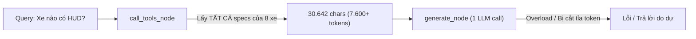
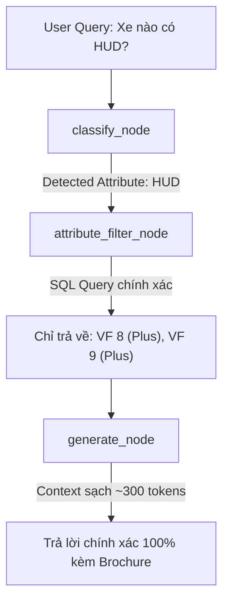
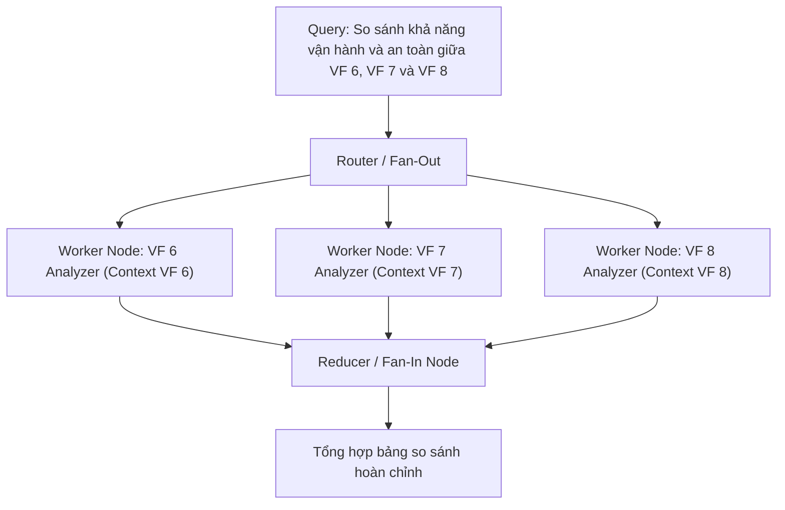
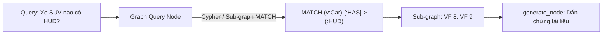

# Đề xuất Kiến trúc: Xử lý Truy vấn Đa Thuộc tính trong Graph Engineering

## Vấn đề hiện tại
Khi người dùng hỏi câu hỏi toàn danh mục hoặc tìm kiếm theo tính năng (ví dụ: *"Những xe nào có màn hình HUD?"*, *"Xe nào có cửa sổ trời và pin trên 400km?"*, *"So sánh giá và tính năng các dòng SUV"*):



- **Context Pollution**: Nhồi toàn bộ thông số (kích thước lốp, túi khí, USB, chiều dài...) của 8 model vào 1 prompt duy nhất làm LLM bị quá tải và "lost in the middle".
- **Lãng phí chi phí & Độ trễ**: Tốn ~8.000 input tokens cho 1 câu hỏi chỉ cần 1 dòng dữ liệu.
- **Vi phạm nguyên tắc Context Isolation**: Node `generate` nhận dữ liệu thô thay vì dữ liệu có chủ đích.

---

## 4 Giải pháp Kiến trúc chuẩn Graph Engineering

---

### 💡 Giải pháp 1: Node Truy vấn Thuộc tính Xác định (Deterministic Attribute Filter Node)
> **Phù hợp nhất cho**: Dữ liệu có cấu trúc sẵn trong PostgreSQL (specs, giá, tính năng, màu sắc).

#### Cơ chế hoạt động:
Thay vì lấy toàn bộ 8 model, tạo một Tool/Node chuyên biệt để lọc trực tiếp từ Database:
```sql
SELECT model_code, version_name, spec_key_vn, spec_value, source_url
FROM car_specs
WHERE spec_key IN ('head_up_display', 'display_inch')
  AND spec_value NOT ILIKE '%không%'
  AND spec_value IS NOT NULL;
```



* **Ưu điểm**:
  - Context giảm từ **30.000 ký tự xuống < 1.000 ký tự** (giảm 97% token).
  - Độ chính xác 100%, loại bỏ hoàn toàn nguy cơ bị ảo giác (hallucination).
  - Tốc độ cực nhanh (< 50ms).
* **Cách triển khai trong Graph**: Thêm 1 tool `query_by_attribute(attribute_type, condition)` và gọi khi `category == "cross_model"`.

---

### 💡 Giải pháp 2: Lọc & Cắt tỉa Động tại Ranh giới Edge (Dynamic Attribute Pruning at Edge)
> **Phù hợp nhất cho**: Giữ nguyên kiến trúc Graph hiện tại nhưng tối ưu hóa tầng `context_builder`.

#### Cơ chế hoạt động:
Nguyên tắc **"Summarize at the edge"** trong Prompt Chaining: Trước khi đẩy `tool_results` vào `generate_node`, `context_builder` sẽ đối chiếu từ khóa trong câu hỏi của người dùng để chỉ giữ lại nhóm thông số liên quan.

```python
# context_builder.py
KEYWORD_TO_CATEGORIES = {
    "hud": ["head_up_display", "display_inch"],
    "cửa sổ trời": ["sunroof_type"],
    "trần kính": ["sunroof_type"],
    "pin": ["battery_kwh", "range_km", "fast_charge_min"],
    "sạc": ["fast_charge_min", "battery_kwh", "charger_map"],
    "kích thước": ["length_mm", "width_mm", "height_mm", "wheelbase_mm"],
    "ghế": ["seats", "leatherette_seats"],
    "an toàn": ["airbags", "surround_view_camera", "tpms", "rollover_mitigation"],
}
```

* **Ưu điểm**:
  - **Không cần sửa cấu trúc Graph hay API**, chỉ nâng cấp logic format chuỗi của `context_builder`.
  - Tự động thu gọn dữ liệu của 8 dòng xe từ 30 trang thông số xuống còn 1 bảng so sánh ngắn gọn đúng tiêu chí người dùng đang hỏi.
* **Độ phức tạp**: Cực kỳ thấp, có thể áp dụng ngay lập tức.

---

### 💡 Giải pháp 3: Mô hình Map-Reduce / Parallel Worker Nodes (Fan-Out & Fan-In)
> **Phù hợp nhất cho**: Các câu hỏi so sánh phân tích sâu hoặc câu hỏi mở phức tạp nhiều tiêu chí.

#### Cơ chế hoạt động:
Sử dụng **Pattern 3 (Parallelization)** & **Pattern 4 (Orchestrator-Workers)**:



* **Ưu điểm**:
  - **Context Isolation tuyệt đối**: Mỗi Worker chỉ xử lý đúng một model, không bị nhiễu chéo thông tin.
  - Chạy song song nên thời gian tổng thể chỉ bằng thời gian của 1 worker chậm nhất.
* **Nhược điểm**: Cần cấu hình State Reducer (`Annotated[list, operator.add]`) và tốn nhiều LLM calls hơn.

---

### 💡 Giải pháp 4: GraphRAG / Entity-Attribute Knowledge Graph Node
> **Phù hợp nhất cho**: Xây dựng hệ sinh thái trợ lý đa năng, quan hệ chéo (chính sách bảo hành, tính năng, phiên bản, giá thuê pin).

#### Cơ chế hoạt động:
Dữ liệu được tổ chức dưới dạng Đồ thị tri thức (Graph Database hoặc NetworkX):
- **Nodes**: Thực thể xe (`VF 8 Plus`), Tính năng (`HUD`), Bộ pin (`87.7 kWh`), Phân khúc (`D-SUV`).
- **Edges**: `(:VF 8 Plus)-[:TRANG_BỊ]->(:HUD)`, `(:VF 8 Plus)-[:CÓ_GIÁ]->(:879_Triệu)`.



* **Ưu điểm**: Xử lý mượt mà các truy vấn logic đa tầng, tìm kiếm ràng buộc phức tạp (ví dụ: *"Tìm xe có thể chở 7 người, sạc dưới 30 phút, giá lăn bánh dưới 1 tỷ"*).
* **Nhược điểm**: Đòi hỏi dựng hạ tầng Graph DB (Memgraph, FalkorDB, Neo4j) hoặc xây dựng Graph Index từ trước.

---

## Bảng So sánh Tổng hợp

| Tiêu chí | Giải pháp 1: SQL Filter Node | Giải pháp 2: Edge Pruning Builder | Giải pháp 3: Map-Reduce Workers | Giải pháp 4: GraphRAG |
|---|---|---|---|---|
| **Độ chính xác** | 100% (Tuyệt đối) | 95% | 95% | 98% |
| **Token tiêu thụ** | ~300 tokens (Cực ít) | ~800 tokens (Ít) | ~2.500 tokens (Trung bình) | ~500 tokens (Ít) |
| **Độ trễ (Latency)** | < 1.0 giây | ~1.2 giây | ~2.0 giây | ~1.5 giây |
| **Độ phức tạp triển khai** | Thấp | Rất thấp (Nhanh nhất) | Trung bình - Cao | Cao |
| **Khả năng mở rộng** | Rất tốt cho bảng Specs | Tốt | Tốt cho bài toán phân tích | Tốt nhất cho toàn bộ hệ thống |

---

## 🎯 Khuyến nghị Lộ trình Triển khai (ROI cao nhất)

1. **Giai đoạn 1 (Làm ngay)**: Áp dụng **Giải pháp 2 (Edge Pruning Builder)** kết hợp **đảo vị trí câu hỏi lên đầu prompt** -> Giải quyết dứt điểm các lỗi context quá dài hiện tại trong 30 phút mà không sửa đổi cấu trúc Graph.
2. **Giai đoạn 2 (Chuẩn hóa Graph)**: Áp dụng **Giải pháp 1 (SQL Attribute Filter Node)** cho các câu hỏi tra cứu danh mục / thuộc tính để đạt độ chính xác 100% với chi phí token gần như bằng 0.
